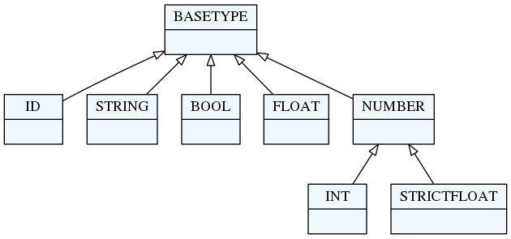

# textX grammar

The language syntax and the meta-model are defined by the textX grammar in the
form of a set of textX rules.

## Rules

The basic building blocks of the textX language are rules. Each rule is written
in the following form:

    Hello:
      'hello' who=ID
    ;

This rule is called `Hello`. After the rule name, there is a colon. The body of
the rule is given as a textX expression, starting at the colon and ending with a
semicolon. This rule tells us that the pattern of `Hello` objects in input
strings consists of the string literal `hello`, followed by the ID rule (here ID
is a reference to a built-in rule, more about this in a moment).

These are valid `Hello` objects:

    hello Alice
    hello Bob
    hello foo1234

Rule `Hello` at the same time defines a Python class `Hello`. When the rule is
recognized in the input stream, an object of this class will get created and the
attribute `who` will be set to whatever the rule `ID` has matched after the word
`hello` (this is specified by the assignment `who=ID`).

Of course, there are many more rule expressions than those shown in this small
example. In the next section, a detailed description of each textX expression is
given.

## textX base types

In the previous example you have seen an `ID` rule. This rule is one of the
built-in rules that form the base of textX's type system. Base types/rules are
depicted in the following figure:



* `ID` rule: matches a common identifier consisting of letters, digits
  and underscores. The regex pattern that describe this rule is `'[^\d\W]\w*\b'`.
  This match will be converted to a Python string.
* `INT` rule: matches an integer number. This match will be converted to
  a Python `int` instance.
* `FLOAT` rule: will match a floating point number. This match will be converted
  to a Python `float` instance ('FLOAT' is a direct subtype of 'BASETYPE';
  in order to distinguish floats and ints, 'STRICTFLOAT' was introduced).
* `STRICTFLOAT` rule: will match a floating point number. This match will be
  converted to a Python `float` instance. A 'STRICTFLOAT' will not match an 'INT'
  (without "." or "e|E"). A 'NUMBER' is either a 'STRICTFLOAT' or an 'INT',
  and will, thus, be converted to a float or an int, respectively.
* `BOOL` rule: matches the words `true` or `false`. This match
  will be converted to a Python `bool` instance.
* `STRING` rule: matches a quoted string. This match will be converted
  to a Python `str` instance.

textX base types are automatically converted to python types during object
instantiation.
See [auto-initialization](metamodel.md#auto-initialization-of-attributes) for
more information.

## Rule expressions

Rule expressions represent the body of a rule. They is specified using basic
expressions and operators.

The basic expressions are:

* [Matches](#matches)
    * String match (`'...'` or `"..."`)
    * Regex match (`/.../`)
* [Sequence](#sequence)
* [Ordered choice](#ordered-choice) (`|`)
* [Optional](#optional) (`?`)
* [Repetitions](#repetitions)
    * Zero or more (`*`)
    * One or more (`+`)
    * Unordered group (`#`)
* [References](#references)
    * Match reference
    * Link reference (`[..]`)
* [Assignments](#assignments)
    * Plain (`=`)
    * Boolean (`?=`)
    * Zero or more (`*=`)
    * One or more (`+=`)
* [Syntactic predicates](#syntactic-predicates)
    * Not (`!`) - negative lookahead
    * And (`&`) - positive lookahead
* [Match suppression](#match-suppression)


### Matches

Match expressions are, besides base type rules, the expressions at the lowest
level. They are the basic building blocks for more complex expressions. These
expressions will consume input on success.

There are two types of match expressions:

* **String match** - is written as a single quoted string. It will match a literal
  string on the input.

    Here are a few examples of string matches:

        'blue'
        'zero'
        'person'

* **Regex match** - uses regular expression defined inside `/ /` to match the
  input. Therefore, it defines a whole class of strings that can be matched.
  Internally a python `re` module is used.

    Here are few example of regex matches:

        /\d*/
        /\d{3,4}-\d{3}/
        /[-\w]*\b/
        /[^}]*/

    For more information on Regular Expression in Python see [Regular Expression
    HOWTO](https://docs.python.org/3/howto/regex.html).

    When the metamodel has the option `use_regexp_group` set to `True`, then a
    regular expression with exactly one group is replaced by the group. This can
    be used to define multiline strings to be stored in the model without the
    surrounding limiters:

          Model: 'data' '=' data=/(?ms)\"{3}(.*?)\"{3}/;

    An example model could be

          data = """
          This is a multiline
          text!
          """

    When creating a metamodel with this grammar and the option
    `use_regexp_group` enabled, a multiline string delimited with `"""` is
    accepted: `(?ms)` activates the multiline option and the *dot matches
    everything* option. `\"{3}` matches the delimited `"""`. The pattern
    `"(.*?)` is a non-greedy variant of *get anything*.

          metamodel = metamodel_from_str(grammar, use_regexp_group=True)


### Sequence

Sequence is a textX expression that is given by just writing contained
sub-expressions one after another. For example,the following rule:

    Colors:
      "red" "green" "blue"
    ;

is defined as a sequence consisting of three string matches (`red` `green` and
`blue`). Contained expressions will be matched in the exact order they are
given. If some of the expressions do not match, the sequence as a whole will
fail. The above rule defined by the sequence will match only the following
string:

    red green blue

```admonish note
If whitespace skipping is enabled (it is by default), arbitrary whitespaces can
occur between matched words.
```

### Ordered choice

Ordered choice is given as a set of expression separated by the`|` operator.
This operator will try to match contained expression from left to right and the
first match that succeeds will be used.

Example:

    Color:
      "red" | "green" | "blue"
    ;

This will match either `red` or `green` or `blue` and the parser will try to
match the expressions in that order.

```admonish note
In most classic parsing technologies an unordered match (alternative) is used.
This may lead to ambiguous grammars where multiple parse tree may exist for the
same input string.
```

Underlying parsing technology of textX
is [Arpeggio](https://github.com/textX/Arpeggio) which is a parser based
on PEG grammars and thus the `|` operator directly translates to Arpeggio's PEG
ordered choice. Using ordered choice yields unambiguous parsing. If the text
parses there is only one possible parse tree.


### Optional

`Optional` is an expression that will match the contained expression if that is
possible, but will not fail otherwise. Thus, optional expression always
succeeds.

Example:

    MoveUp:
      'up' INT?
    ;

`INT` match is optional in this example. This means that the `up` keyword is
required, but the following integer may or may not be found.

Following lines will match:

    up 45
    up 1
    up

Optional expressions can be more complex. For example:

    MoveUp:
      'up' ( INT | FLOAT )?

Now, an ordered choice in the parentheses is optional.


### Repetitions

* **Zero or more** repetition is specified by the `*` operator and will match
  the contained expression zero or more times. Here is an example:

        Colors:
          ("red"|"green"|"blue")*
        ;

    In this example *zero or more* repetition is applied on the *ordered
    choice*. In each repeated match one color will be matched, trying from left
    to right. Thus, `Colors` rule will match color as many times as possible,
    but will not fail if no color exists in the input string. The following
    would be matched by the `Colors` rule:

        red blue green

    but also:

        red blue blue red red green

    or an empty string.


* **One or more** repetition is specified by `+` operator and will match the
  contained expression one or more times. Thus, everything that is written for
  **zero or more** applies here except that at least one match must be found for
  this expression to succeed. Here is an above example modified to match at
  least one color:

        Colors:
          ("red"|"green"|"blue")+
        ;

* **Unordered group** is a special kind of a sequence. Syntactically it is
  similar to a repetition. It is specified by the `#` operator and must be
  applied to either sequences or ordered choices. This operator will match each
  element of the sequence or the ordered choice in an arbitrary order:

        Colors:
          ("red" "green" "blue")#
        ;

    For the previous example all following lines are valid:

        red blue green
        red green blue
        blue green red
        ...

    But, the following lines are not valid:

        red blue red green
        blue green

    Consider this example:

        Modifier:
            (static?='static' final?='final' visibility=Visibility)#
        ;

        Visibility:
            'public' | 'private' | 'protected';

    We want to provide modifiers to the type declarations in our language.
    Furthermore, we want modifiers to be written in any order.

    The following lines will match (thanks to `?=` operator, only visibility
    must be specified):

        public
        public static
        final protected static
        ...

    You can combine unordered groups with parenthesized groups. Lets look at the
    following example:

        Unordered:
          (('first' 'second')  'third')#
        ;

    This will match group with sequence `first second` and `third` in arbitrary
    order but the sequence `first second` maintains the order. Thus, these
    inputs will match:

        first second third
        third first second

    But these won't:

        third second first
        second first third

    Alternatively, you can use ordered choice instead of grouping. This will be
    equivalent with the previous example:

        Unordered:
          ('first' 'second' | 'third')#
        ;

```admonish
Unordered group may also have [repetition modifiers](#repetition-modifiers)
defined.
```


### Assignments

Assignments are used as a part of the meta-model deduction process. Each
assignment will result in an attribute of the meta-class created by the rule.

Each assignment consists of the LHS (left-hand side) and the RHS (right-hand
side). The LHS is always a name of the meta-class attribute while the RHS can be
a reference to other rules (either a match or a link reference) or a simple
match (string or regex match). For example:

    Person:
      name=Name ',' surname=Surname ',' age=INT ',' height=INT ';'
    ;

The `Name` and `Surname` rules referenced in the RHS of the first two
assignments are not given in this example.

This example describes the rule and meta-class `Person`, that will parse and
instantiate the `Person` objects with  these four attributes:

* `name` - which will use the rule `Name` to match the input, it
  will be a reference to the instance of the `Name` class,
* `surname` - will use `Surname` rule to match the input,
* `age` - will use the built-in type `INT` to match a number from the
  input string. `age` will be converted to the python `int` type.
* `height` - the same as `age`, but the matched number will be
  assigned to the `height` attribute of the `Person` instance.

Notice the comma as the separator between matches and the semicolon match at the
end of the rule. Those matches must be found in the input but the matched
strings will be discarded. They represent a syntactic noise.

If the RHS is one of textX BASETYPEs, then the matched string will be converted
to some of the plain python types (e.g. `int`, `string`, `boolean`).

If the RHS is a string or regex match like in this example:

    Color:
      color=/\w+/
    ;

then the attribute given by the LHS will be set as the string matched by the RHS
regular expression or string.

If the RHS is a reference to some other rule, then the attribute given by the
LHS will be set to refer to the object created by the RHS rule.

Following strings are matched by the `Person` rule from above:

    Petar, Petrovic, 27, 185;
    John, Doe, 34, 178;


There are four types of assignments:

* **Plain assignment** (`=`) will match its RHS once and assign what is
  matched to the attribute given by the LHS. The above example uses plain
  assignments.

    Examples:

        a=INT
        b=FLOAT
        c=/[a-Z0-9]+/
        dir=Direction

* **Boolean assignment** (`?=`) will set the attribute to `True` if
  the RHS match succeeds and to `False` otherwise.

    Examples::

        cold ?= 'cold'
        number_given ?= INT

* **Zero or more assignment** (`*=`) - LHS attribute will be a `list`. This
  assignment will keep matching the RHS as long as the match succeeds and each
  matched object will be appended to the attribute. If no match succeeds, the
  attribute will be an empty list.

    Examples::

        commands*=Command
        numbers*=INT

* **One or more assignment** (`+=`) - same as the previous assignment, but it must match the RHS
  at least once. If no match succeeds, this assignment does not succeed.


#### Multiple assignment to the same attribute

textX allows for multiple assignments to the same attribute. For example:

      MyRule:
          a=INT b=FLOAT a*=ID
      ;

Here `a` attribute will always be a Python list. The type of `a` will be
`OBJECT` as the two assignments have declared different types for `a` (`INT` and
`ID`).

Consider this example:

      Method:
          'func(' (params+=Parameter[','])? ')'
      ;
      Parameter:
          type=ID name=ID | name=ID
      ;

In `Parameter` rule, the `name` attribute assignments are part of different
ordered choice alternatives and thus name will never have more than one value
and thus should not be a list. The type of `name` is consistent in both
assignments so it will be `ID`.

The rule of the thumb for multiple assignments is that if there is no
possibility for an attribute to collect more than one value during parsing it
will be a single value object, otherwise it will be a list.


### References

Rules can reference each other. References are usually used as a RHS of the
assignments. There are two types of rule references:

* **Match rule reference** - will *call* another rule. When instance of the called
  rule is created, it will be assigned to the attribute on the LHS. We say that the
  referred object is contained inside the referring object (i.e. they form a
  [parent-child relationship](metamodel.md#parent-child-relationships)).

    Example::

        Structure:
          'structure' '{'
            elements*=StructureElement
          '}'
        ;

    `StructureElement` will be matched zero or more times. With each match, a new
    instance of the `StructureElement` will be created and appended to the `elements`
    python list. A `parent` attribute of each `StructureElement` will be set to
    the containing `Structure`.

* **Link rule reference** - is written as a referred rule name inside square
  brackets. It will match an identifier of some class object at the given place
  and convert that identifier to a Python reference to the target object. This
  reference resolving is done automatically by textX. By default, a `name`
  attribute is used as the identifier of the object. By default, all objects of
  the same class are in a single namespace. This can be configured by [scope
  providers](scoping.md) and [Reference Resolving Expression Language](rrel.md).

    Example:

        ScreenType:
          'screen' name=ID "{"
          '}'
        ;

        ScreenInstance:
          'screen' type=[ScreenType]
        ;

    The `type` attribute is a link to the `ScreenType` object. This is a valid
    usage:

        // This is a definition of the ScreenType object
        screen Introduction {

        }

        // And this is a reference link to the ScreenType object defined above
        // ScreenInstance instance
        screen Introduction

    `Introduction` will be matched, the `ScreenType` object with that name will
    be found and the `type` attribute of `ScreenInstance` instance will be set to
    it.

    `ID` rule is used by default to match the link identifier. If you want to change
    that, you can use the following syntax:

        ScreenInstance:
          'screen' type=[ScreenType:WORD]
        ;

    Here, instead of `ID` a `WORD` rule is used to match the object's identifier.


```admonish note
Attributes with `name` names are used for reference auto-resolving. By default,
a dict lookup is used, thus they must be of a hashable type. See issues
[#40](https://github.com/textX/textX/issues/40) and
[#266](https://github.com/textX/textX/issues/266).

A usual error is to match the name in this fashion:

    MyObj: name+=ID['.'];

Here, `name` will be a list of strings that are separated by dot and that will
not work as the name must be hashable. The best way to implement this and make
`name` hashable is:

    MyObj: name=FQN;
    FQN: ID+['.'];

Now, `name` will be the string returned by the `FQN` match rule.
```


### Syntactic predicates

Syntactic predicates are operators that are used to implement lookahead. The
lookahead is used to do parsing decision based on the part of the input ahead of
the current position. Syntactic predicates are written as a prefix of some textX
rule expression. The rule expression will be used to match input ahead of the
current location in the input string. It will either fail or succeed but will
never consume any input.

There are two type of syntactic predicates:

* **Not - negative lookahead** (`!`) - will succeed if the current input doesn't
  match the expression given after the `!` operator.

    Example problem:

        Expression: Let | ID | NUMBER;
        Let:
            'let'
                expr+=Expression
            'end'
        ;

    In this example we have nested expressions built with indirectly recurssive
    `Let` rule. The problem is that the `ID` rule from `Expression` will match
    keyword `end` and thus will consume end of `Let` rule, so the parser will
    hit EOF without completing any `Let` rules. To fix this, we can specify that
    `ID` will match any identifier except keywords `let` and `end` like this:

        Expression: Let | MyID | NUMBER;
        Let:
            'let'
                expr+=Expression
            'end'
        ;
        Keyword: 'let' | 'end';
        MyID: !Keyword ID;

    Now, `MyID` will match `ID` only if it is not a keyword.


* **And - positive lookahead** (`&`) - will succeed if the current input starts
  with the string matched by the expression given after the `&` operator.

    Example:

        Model:
            elements+=Element
        ;
        Element:
            AbeforeB | A | B
        ;
        AbeforeB:
            a='a' &'b'      // this succeeds only if 'b' follows 'a'
        ;
        A: a='a';
        B: a='b';

    Given the input string `a a a b` first two `a` chars will be matched by the
    rule `A`, but the third `a` will be matched by the rule `AbeforeB`.  So,
    even when `AbeforeB` matches only `a` and is tried before any other match,
    it will not succeed for the first two `a` chars because they are not
    followed by `b`.


### Match suppression

Sometimes it is necessary to define match rules that should return only parts of
the match. For that we use match the suppression operator (`-`) after the
expression you want to suppress.

For example:

    FullyQualifiedID[noskipws]:
        /\s*/-
        QuotedID+['.']
        /\s*/-
    ;
    QuotedID:
        '"'?- ID '"'?-
    ;

Because we use `noskipws` rule modifier, `FullyQualifiedID` does not skip
whitespaces automatically. Thus, we have to match whitespaces ourself, but we
don't want those whitespaces in the resulting string. You might wonder why we
are using `noskipws`. It is because we do not want whitespaces in between each
`QuotedID` match. So, for example, `first. second` shouldn't match but
`first.second` should.

In the rule `FullyQualifiedID` we are suppressing whitespace matches `/\s*/-`.
We also state in `QuotedID` that there are optional quotation marks around each
ID, but we don't want those either `'"'?-`.

Given this input:

    first."second".third."fourth"

`FullyQualifiedID` will return:

    first.second.third.fourth


## Repetition modifiers

Repetition modifiers are used for the modification of the repetition expressions
(`*`, `+`, `#`, `*=`, `+=`). They are specified in brackets `[ ]`. If there are
more modifiers, they are separated by a comma.

Currently, there are two modifiers defined:

* **Separator modifier** - is used to define separator on multiple matches.
  Separator is a simple match (string match or regex match).

    Example:

        numbers*=INT[',']

    Here, a separator string match is defined (`','`). This will match zero
    or more integers separated by commas.

        45, 47, 3, 78

    A regex can also be specified as a separator.

        fields += ID[/;|,|:/]

    This will match IDs separated by either `;` or `,` or `:`.

        first, second; third, fourth: fifth

* **End-of-line terminate modifier** (`eolterm`) - used to terminate repetition
  on end-of-line. By default the repetition match will span lines. When this
  modifier is specified, repetition will work inside the current line only.

    Example:

        STRING*[',', eolterm]

    Here we have a separator as well as the `eolterm` defined. This will match
    zero or more strings separated by commas inside one line.

        "first", "second", "third"
        "fourth"

    If we run the example expression once on this string, it will match the
    first line only. `"fourth"` in the second line will not be matched.

```admonish warning
Be aware that when `eolterm` modifier is used, its effect starts from the
previous match. For example:

    Conditions:
      'conditions' '{'
        varNames+=WORD[eolterm]    // match var names until end of line
      '}'

In this example `varNames` must be matched in the same line as
`conditions {` because `eolterm` effect start immediately.
In this example we wanted to give the user the freedom to specify var names on
the next line, even to put some empty lines if he/she wishes. In order to do
that, we should modify the example like this::

    Conditions:
      'conditions' '{'
        /\s*/
        varNames+=WORD[eolterm]    // match var names until end of line
      '}'

Regex match `/\s*/` will collect whitespaces (spaces and new-lines)
before the `WORD` match begins. Afterwards, repeated matches will work
inside one line only.
```

## Rule types

There are three kinds of rules in textX:

- Common rules (or just rules)
- Abstract rules
- Match rules

**Common rules** are rules that contain at least one assignment, i.e., they
have attributes defined. For example:

    InitialCommand:
      'initial' x=INT ',' y=INT
    ;

This rule has two defined attributes: `x` and `y`.

**Abstract rules** are rules that have no assignments and reference at least one
abstract or common rule. They are usually given as an ordered choice of other
rules and they are used to generalize other rules. For example:

    Program:
      'begin'
        commands*=Command
      'end'
    ;

    Command:
      MoveCommand | InitialCommand
    ;

In this example, Python objects in the `commands` list will either contain
instances of `MoveCommand` or `InitialCommand`. `Command` rule is abstract. A
meta-class of this rule will never be instantiated. Abstract rule can also be
used in link rule references:

    ListOfCommands:
      commands*=[Command][',']
    ;

Abstract rules may reference match rules and base types. For example:

    Value:
        STRING | FLOAT | BOOL | Object | Array | "null"
    ;

In this example, the base types as well as the string match `"null"` are all
match rules, but `Object` and `Array` are common rules and therefore `Value` is
abstract.

Abstract rules can be a complex mix of rule references and match expressions as
long as there is at least one abstract or common reference. For example:

    Value:
      'id' /\d+-\d+/ | FLOAT | Object
    ;

A rule with a single reference to an abstract or common rule is also abstract:

    Value:
      OtherRule
    ;

Abstract rules can have multiple references in a single alternative with the
following rules:

- If all rule references in a single alternative are match rules the result will
  be a concatenation of all match rule results,
- If there is a common rule reference then it would be the result and all
  surrounding match rules are used only for parsing
- If there are multiple common rules then the first will be used as a result and
  the rest only for parsing

For example:

    Model: STRING | ID | '#' Rule1 Sufix;  // abstract rule
    Rule1: a=INT;  // common rule
    Prefix: '#';
    Sufix: ID | SomeOtherSufix;
    SomeOtherSufix: '--' '#';

In this example matching `# 42 -- #` at input would yield and instance of
`Rule1` with attribute `a` set to integer `42`. This comes from a third
alternative `'#' Rule1 Sufix` that succeeds and the `#` and `Sufix` would be
used just for parsing and the result would be discarded.

Another example:

    Model: (STRING | ID | '#' Rule1) Sufix;
    Rule1: a=INT; // common rule
    Sufix: '--';

This is also abstract rule as we are referencing `Rule1` which is a common rule
and we have no assignments. Matching `# 42 --` as input will give an instance of
`Rule1` with attribute `a` set to integer `42`.

In this example:

    Model: STRING|Rule1|ID|Prefix INT Sufix;
    Rule1: a='a';  // a common rule
    Prefix: '#';
    Sufix: '--';

we see that input `# 42 --` would be recognized by the last alternative and the
result will be string `#42--`, i.e. all match rule results would be concatenated.
But if we give `a` as input than the result will be an instance of `Rule1` with
attribute `a` set to string `'a'`.

In the following example we see what happens if we have multiple common rule references:

    Model: STRING|Rule1|ID|Prefix Rule1 Sufix Rule2;  // Reference both Rule1 and Rule2
    Rule1: a=INT; // common rule
    Rule2: a=STRING; // common rule
    Prefix: '#';
    Sufix: '--';

For input `# 42 -- "some string"` the model will be an instance of `Rule1` with
attribute `a` set to `42` as it is the first common rule reference in the last
alternative (the one that succeeds) but `Rule2`, despite being discarded, must
also be satisfied during parsing or syntax error would be produced.

**Match rules** are rules that have no assignments either direct or indirect,
i.e. all referenced rules are match rules too. They are usually used to specify
enumerated values or some complex string matches that can't be done with regular
expressions.

Examples:

    Widget:
      "edit"|"combo"|"checkbox"|"togglebutton"
    ;

    Name:
      STRING|/(\w|\+|-)+/
    ;

    Value:
      /(\w|\+|-)+/ | FLOAT | INT
    ;

These rules can be used in match references only (i.e., you can't link to these
rules as they don't exists as objects), and they produce objects of the base
python types (`str`, `int`, `bool`, `float`).

All base type rules (e.g., `INT`, `STRING`, `BASETYPE`) are match rules.


## Rule modifiers

Rule modifiers are used for the modification of the rule's expression. They are
specified in brackets (`[ ]`) at the beginning of the rule's definition after
the rule's name. Currently, they are used to alter parser configuration for
whitespace handling on the rule level.

Rule modifiers act on the current rule and all rules referenced inside the rule
(recursively): unless a refrenced rule has an explicit rule modifier, the currently
active modifier state is propagated to referenced rules.

There are two rule modifiers at the moment:

* **skipws, noskipws** - are used to enable/disable whitespace skipping during
  parsing. This will change the global parser's `skipws` setting given during
  the meta-model instantiation.

  Example:

      Rule:
          'entity' name=ID /\s*/ call=Rule2;
      Rule2[noskipws]:
          'first' 'second';

  In this example `Rule` rule will use default parser behaviour set during the
  meta-model instantiation, while `Rule2` rule will disable whitespace
  skipping. This will change `Rule2` to match the word `firstsecond`, but not
  words `first second` with whitespaces in between.

  ```admonish note
  Remember that whitespace handling modification will start immediately
  after the previous match. In the above example, additional `/\s*/` is
  given before the `Rule2` call to consume all whitespaces before trying
  to match `Rule2`.
  ```

* **ws** - used to redefine what is considered to be a whitespaces on the rule
  level. textX by default treats space, tab and new-line as a whitespace
  characters. This can be changed globally during the meta-model instantiation
  (see [Whitespace handling](parser_config.md#whitespace-handling)) or per rule
  using this modifier.

  Example:

      Rule:
          'entity' name=ID /\s*/ call=Rule2;
      Rule2[ws='\n']:
          'first' 'second';

  In this example `Rule` will use the default parser behavior but the `Rule2`
  will alter the white-space definition to be new-line only. This means that
  the words `first` and `second` will get matched only if they are on separate
  lines or in the same line but without other characters in between (even tabs
  and spaces).
  
  ```admonish note
  As in the previous example, the modification will start immediately, so
  if you want to consume preceding spaces you must do that explicitly, as
  given with `/\s*/` in the `Rule`.
  ```


## Grammar comments

Syntax for comments inside a grammar is `//` for line comments and `/* ... */`
for block comments.

## Language comments

To support comments in your DSL use a special grammar rule `Comment`. textX will
try to match this rule in between each other normal grammar match (similarly to
the whitespace matching). If the match succeeds, the matched content will be
discarded.


For example, in the [robot language example](tutorials/robot.md) comments are
defined like this:

    Comment:
      /\/\/.*$/
    ;

Which states that everything starting with `//` and continuing until the end of
line is a comment.


## Grammar modularization

Grammars can be defined in multiple files and then imported. Rules used in the
references are first searched for in the current file and then in the imported
files, in the order of the import.

  Example:

    import scheme

    Library:
      'library' name=Name '{'
        attributes*=LibraryAttribute

        scheme=Scheme

      '}'
    ;

`Scheme` rule is defined in `scheme.tx` grammar file imported at the beginning.

Grammar files may be located in folders. In that case, dot notation is used.

  Example:

    import component.types

`types.tx` grammar is located in the `component` folder relatively to the
current grammar file.

If you want to override the default search order, you can specify a fully
qualified name of the rule using dot notation when giving the name of the
referring object.

  Example:

    import component.types

    MyRule:
      a = component.types.List
    ;

    List:
      '[' values+=BASETYPE[','] ']'
    ;

`List` from `component.types` is matched/instantiated and set to `a` attribute.


## Inspecting textX grammars programmatically

Since textX is a meta-language (a language for language definition) any textual
language can be specified using it, even [textX grammar language
itself](https://github.com/textX/textX/blob/master/textx/textx.tx).

This definition enable loading of textX grammar as a plain Python model which
can be further analyzed for various purposes. This can be used, e.g. for tooling
which need to analyze the grammar beyond of just syntactic and semantic checks
(e.g. syntax highlighting may analyze grammar to discover keywords that needs to
be colored).

To load grammar model first get the textX language meta-model with:

```python
textx_mm = metamodel_for_language('textx')
```

and then call either `grammar_model_from_str` or `grammar_model_from_file`
method on this meta-model object:

```
grammar_model = textx_mm.grammar_model_from_file(
    join(abspath(dirname(__file__)), 'pyflies.tx'))
```

Then investigate this model as you would do with any other model:

```
assert len(grammar_model.imports_or_references) == 3
assert len(grammar_model.rules) == 45

str_matches = get_children_of_type("SimpleMatch", grammar_model)
...
```
