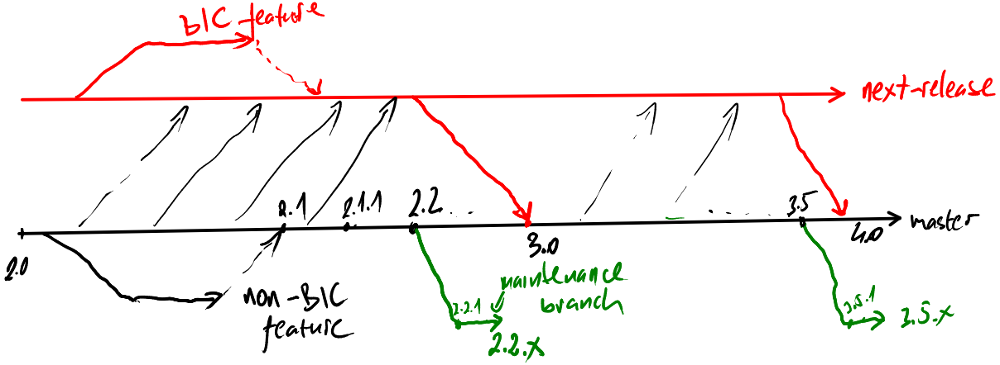

# textX release process

```admonish
For the background see [here](https://github.com/textX/textX/issues/176).
```

- We are using semantic versioning and a standard format to keep changelogs (see
  [CHANGELOG.md](https://github.com/textX/textX/blob/master/CHANGELOG.md)).
- We develop features on feature branches. Feature branches are named
  `feature/<feature name>`.
- We fix bugs on bugfix branches named as `bugfix/<issue no>-<name>`
- We have a branch for the upcoming major release -- `next-release` (red in the
  picture bellow).
- If the feature is backward incompatible (BIC) the PR is made against the
  `next-release` branch (not against the `master` branch)
- If the feature is backward compatible PR is made against the `master`.
- Thus, `Unreleased` section in the changelog on the `master` branch will never
  have any BIC change. All BIC changes should go to the changelog on the
  `next-release` branch.
- We constantly merge `master` branch to `next-release` branch. Thus,
  `next-release` branch is the latest and greatest version with **all** finished
  features applied.
- When the time for minor release come we follow [textX release
  checklist](./#textx-release-checklist) defined bellow.
- When the time for major release come we merge `next-release` branch to
  `master` and follow [textX release checklist](./#textx-release-checklist)
  defined bellow.




 
# textX release checklist

  1. If minor/major version increase, create maintenance/support branch from the
     current master. The name is `support/v<previous major.minor.x>` (e.g.
     `support/v2.0.x`).
  2. Create a temporary branch for preparing the next release called
     `release-preparation` and switch to that branch.
  3. Update version in the `textX/__init__.py`.
  4. Update CHANGELOG (create new section for the release, update github links,
     give credits to contributors).
  5. Push release branch and create PR. Wait for tests to pass. Wait for the
     review process to complete.
  6. Delete all previous distributions in the `dist` folder.
  7. Create whl/tar.gz packages

      ```
      python setup.py bdist_wheel sdist
      ```

  8. Release to PyPI testing

      ```
      python setup.py publishtest
      ```

  9. Release to PyPI

      ```
      python setup.py publish
      ```

  10. In case of errors repeat steps 3-10.
  11. Create git tag in the form of `v<version>` (e.g. `v2.1.0`). Push the tag.
  12. Merge PR and delete PR branch (`release-preparation`).
  13. Change the version in `textX/__init__.py` to next minor version with
      `.dev0` addition (e.g. `v2.2.0.dev0`).
  14. Merge `master` to `next-version` to keep it up-to-date.

```admonish
For supporting previous versions only bugfix releases will be made. The process
is similar. The difference for support release would be that release process
would be based of the `support` branch instead of the `master` branch as is done
for regular releases. Thus, for support release, we would skip step 1, in step 5
we would create PR against the support branch, and we won't do steps 13-15.
```

