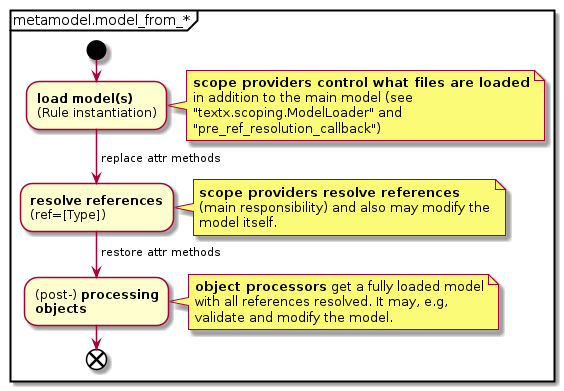

# textX Scoping


## Motivation and Introduction to Scoping

Assume a grammar with references as in the following example (grammar snippet).

    MyAttribute:
            ref=[MyInterface:FQN] name=ID ';'
    ;

The scope provider is responsible for the reference resolution of such a
reference.

The default behavior (default scope provider) is looking for the referenced name
globally (not taking any nested model structures into account, such as nested
model-packages, model-namespaces or similar).

Other scope providers will take namespaces into account, support references to
parts of the model stored in different files or even models defined by other
metamodels (imported into the current metamodel). Moreover, scope providers
exist that allow to reference model elements relative to other referenced model
elements. For example, this can be a referenced method defined in a referenced
class of an instance (with a metamodel defining classes, methods and instances
of classes).


## Usage

The scope providers are registered with a metamodel and can be bound to specific
attributes of grammar rules:

 * e.g., `my_meta_model.register_scope_providers({"*.*": scoping.providers.FQN()})`
   bounds `FQN` provider to all attributes of all grammar rules due to `*.*`
 * or: `my_meta_model.register_scope_providers({"MyAttribute.ref": scoping.providers.FQN()})`
   bounds `FQN` provider to attribute `ref` of grammar rule `MyAttribute`
 * or: `my_meta_model.register_scope_providers({"*.ref": scoping.providers.FQN()})`
   bounds `FQN` provider to `ref` attribute of all grammar rules.
 * or: `my_meta_model.register_scope_providers({"MyAttribute.*": scoping.providers.FQN()})`
   bounds `FQN` provider to all attributes of `MyAttribute` grammar rule

Example (from [tests/test_scoping/test_local_scope.py](https://github.com/textX/textX/blob/master/tests/functional/test_scoping/test_local_scope.py)):

```textx
# Grammar snippet (Components.tx)
Component:
    'component' name=ID ('extends' extends+=[Component:FQN][','])? '{'
        slots*=Slot
    '}'
;
Slot: SlotIn|SlotOut;
# ...
Instance:
    'instance' name=ID ':' component=[Component:FQN] ;
Connection:
    'connect'
      from_inst=[Instance:ID] '.' from_port=[SlotOut:ID]
    'to'
      to_inst=[Instance:ID] '.' to_port=[SlotIn:ID]
;
```

```python
# Python snippet
my_meta_model = metamodel_from_file(
    os.path.join(abspath(dirname(__file__)), 'components_model1', 'Components.tx')

my_meta_model.register_scope_providers({
    "*.*": scoping_providers.FQN(),
    "Connection.from_port": scoping_providers.RelativeName(
        "from_inst.component.slots"),
    "Connection.to_port": scoping_providers.RelativeName(
        "to_inst.component.slots"),
})
```


This example selects the fully qualified name provider as default provider
(`"*.*"`). Moreover, for special attributes of a `Connection` a relative name
lookup is specified: here the `path` from the rule `Connection` containing the
attribute of interest (e.g. `Connection.from_port`) to the referenced element is
specified (the slot contained in `from_inst.component.slots`). Since this
attribute is a list, the list is searched to find the referenced name.

```admonish
Special rule selections (e.g., `Connection.from_port`) are preferred to wildcard
selection (e.e, `"*.*"`).
```

### Scope Providers defined in Module "textx.scoping.providers"

```admonish
The scope provider implementations presented here assume that the `name`
attribute of named elements has a string type (e.g. ´name=ID´).
```


We provide some standard scope providers:

 * `textx.scoping.providers.PlainName`: This is the **default provider** of
   textX. It implements global naming within one model (model file/string) 
   without namespaces.
 * `textx.scoping.providers.FQN`: This is a **provider similar to Java or Xtext
   name loopup** within one model (model file/string).
   Example: see [tests/test_scoping/test_full_qualified_name.py](https://github.com/textX/textX/blob/master/tests/functional/test_scoping/test_full_qualified_name.py).
   
   A central feature of this scope provider is, that it **traverses the model
   tree and searches for a matching sequence of named objects** (objects with
   an attribute `name` matching parts of the full qualified name separated by
   dots). You can also provide a **callback** (`scope_redirection_logic`) to
   specify that certain named objects are not searched recursively, but are
   replaced by a list of objects instead, which are searched in place of the
   current object. With this feature you can create, e.g., **namespace/package
   aliases** in your language. You can also activate a **python like module
   import behavior** for your language (with
   `textx.scoping.providers.FQNImportURI`), which is based on this callback.
   Example: see
   [tests/functional/regressions/test_issue103_python_like_import.py](https://github.com/textX/textX/blob/master/tests/functional/regressions/test_issue103_python_like_import.py).
   
   ```
       package p1 {
           package p2 {
               class a {};
           }
       }
       using p1.p2 as main
       var x = new p1.p2.a()
       var y = new main.a()
   ```


   ```admonish
   Except in the context of the `scope_redirection_logic` (see above),
   the FQN does not take Postponed (unresolved) references into account. The
   reason is that this would create a much more complex decision logic to
   decide which reference needs to be resolved first. The purpose of the FQN is
   to identify direct instances of model objects, and no references.
   ```
        
 * `textx.scoping.providers.ImportURI`: This a provider which **allows to load
    additional modules** for lookup.
    You need to define a rule with an attribute `importURI` as string (like in
    Xtext). This string is then used to load other models. Moreover, you need
    to provide another scope provider to manage the concrete lookup, e.g., the
    `scope_provider_plain_names` or the `scope_provider_fully_qualified_names`.
    Model objects formed by the rules with an `importURI` attribute get an
    additional attribute `_tx_loaded_models` which is a list of the loaded
    models by this rule instance.
    Example: see [tests/test_scoping/test_import_module.py](https://github.com/textX/textX/blob/master/tests/functional/test_scoping/test_import_module.py).
    
    - `FQNImportURI` (decorated scope provider)
    - `PlainNameImportURI` (decorated scope provider)
    
    You can use ***globbing*** (e.g. `import "*.data"`) with the ImportURI
    feature. This is implemented via the Python `glob` module. Arguments can be
    passed to the `glob.glob` function (`glob_args`), e.g., to enable recursive
    globbing. Alternatively, you can also specify a list of ***search
    directories***. In this case globbing is not allowed and is disabled
    (reason: it is unclear if the user wants to glob over all search path
    entries or to stop after the first match). Example: see
    [tests/test_scoping/test_import_module_search_path_issue66.py](https://github.com/textX/textX/blob/master/tests/functional/test_scoping/test_import_module_search_path_issue66.py).

 * `textx.scoping.providers.GlobalRepo`: This is a provider where **you initially
   need to specifiy the model files to be loaded and used for lookup**. Like
   for `ImportURI` you need to provide another scope provider for the concrete
   lookup.
   Example: see [tests/test_scoping/test_global_import_modules.py](https://github.com/textX/textX/blob/master/tests/functional/test_scoping/test_global_import_modules.py).
    - `textx.scoping.providers.FQNGlobalRepo` (decorated scope provider)
       
       Here, you can also activate the "importAs" feature to allow to make
       imported models not visible in your root namespace, but related to
       a named importURI element ([tests/test_scoping/importURI_variations/test_importURI_variations.py](https://github.com/textX/textX/blob/master/tests/functional/test_scoping/importURI_variations/test_importURI_variations.py))
       
       You can also transform the importURI attribute to a filename:
       see ([tests/test_scoping/importURI_variations/test_importURI_variations.py](https://github.com/textX/textX/blob/master/tests/functional/test_scoping/importURI_variations/test_importURI_variations.py).
       
    - `textx.scoping.providers.PlainNameGlobalRepo` (decorated scope provider)

 * `textx.scoping.providers.RelativeName`: This is a scope provider to **resolve
   relative lookups**: e.g., model-methods of a model-instance, defined by the
   class associated with the model-instance. Typically, another reference (the
   reference to the model-class of a model-instance) is used to determine the
   concrete referenced object (e.g. the model-method, owned by a model-class).
   Example: see [tests/test_scoping/test_local_scope.py](https://github.com/textX/textX/blob/master/tests/functional/test_scoping/test_local_scope.py).

 * `textx.scoping.providers.ExtRelativeName`: The same as `RelativeName` **allowing
   to model inheritance or chained lookups**.
   Example: see [tests/test_scoping/test_local_scope.py](https://github.com/textX/textX/blob/master/tests/functional/test_scoping/test_local_scope.py).


### Note on Uniqueness of Model Elements (global repository)

Two different models created using one single meta-model (not using a scope
provider like `GlobalRepo`, but by directly loading the models from file) have
different instances of the same model elements. If you need two such models to
share their model element instances, you can specify this, while creating the
meta model (`global_repository=True` or
`global_repository=instance_of_a_global_repo`). Then, the meta model will store
an own instance of a `GlobalModelRepository` as a base for all loaded models.

Model elements in models including other parts of the model (possibly circular)
have unique model elements (no double instances).

Examples see [tests/test_scoping/test_import_module.py](https://github.com/textX/textX/blob/master/tests/functional/test_scoping/test_import_module.py).


### Included model retrieval

When a model includes or references other model (model files), the scope 
providers in `textx.scoping.providers` use the field `_tx_model_repository`
of the model object to keep track of the included models.

 * You can get a list of all included model objects of a model
   and the model itself with
   `textx.scoping.providers.get_all_models_including_attached_models`.
 * You can check if a model file is included by a model with
   `textx.scoping.providers.is_file_included_by_model`.
 

### Builtin models

Similarly to [builtin objects](metamodel.md#built-in-objects) that are searched
by their names, as a fallback you can provide model repository using
`builtin_models` parameter during meta-model construction. These models will be
searched by scoping providers based on `ImportURI` scoping provider after
searching into a local model and all loaded models fails.

This is handy to provide builtin models of the language that are pre-loaded and
don't need to be imported by each user model.

Here is a full example that demonstrates this feature:

```python
from textx import metamodel_from_str, metamodel_for_language, register_language
from textx.scoping import ModelRepository

types_mm = metamodel_from_str(r'''
Model: types+=BaseType;
BaseType: 'type' name=ID;
''')

# We register `types` language to be available by `reference` 
# statement in the main meta-model
register_language('types', '*.type', 'Simple types language', types_mm)

# Now in the main meta-model we use `references` to access the
# type language. We also use RREL for `Property.type` (+m:types) to
# specify where instances of `BaseType` can be found.
entity_mm_str = r'''
reference types as t
Model: entities+=Entity;
Entity: 'entity' name=ID '{'
              properties*=Property
        '}'
;
Property: name=ID ':' type=[t.BaseType:ID|+m:types];
'''

# Get `types` language meta-model
types_mm = metamodel_for_language('types')

builtin_models = ModelRepository()

# Construct types model and add it to the repository.
# We instantiate the types model with two BaseType instances: `int` and `bool`
builtin_models.add_model(types_mm.model_from_str('type int type bool'))

# BaseType object `int` and `bool` will now be available to the
# entity meta-model. Standard RREL search mechanism will be used to find the
# referenced model object
entity_mm = metamodel_from_str(entity_mm_str, builtin_models=builtin_models)

# In this model `bool` type is accessible despite not being explicitly imported.
model = entity_mm.model_from_str(r'''
entity First {
    first : bool
}
''')

assert model.entities[0].properties[0].type.name == 'bool'
assert model.entities[0].properties[0].type.__class__.__name__ == 'BaseType'
''')

```


## Technical aspects and implementation details

The scope providers are Python callables accepting `obj, attr, obj_ref`:

 * `obj`     : the object representing the start of the search (e.g., a rule,
               like`MyAttribute` in the example above, or the model)
 * `attr`    : a reference to the attribute (e.g. `ref` in the first example above)
 * `obj_ref` : a `textx.model.ObjCrossRef` - the reference to be resolved

The scope provider return the referenced object (e.g. a `MyInterface` object in
the example illustrated in the `Motivation and Introduction` above (or `None` if
nothing is found; or a `Postponed` object, see below).

The scope provider is responsible to check the type and throw a
`TextXSemanticError` if the type is not OK.

Scope providers shall be stateless or have unmodifiable state after
construction: this means they should allow to be reused for different models
(created using the same meta-model) without interacting with each other. This
means, they must save their state in the corresponding model, if they need to
store data (e.g., if they load additional models from files *during name
resolution*, they are not allowed to store them inside the scope provider.

Models with references being resolved have a temporary attribute
`_tx_reference_resolver` of type `ReferenceResolver`. This object can be used to
resolve the object. It contains information, such as the parser in charge for
the model (file) being processed.

```admonish
Scope providers as normal functions (`def <name>(...):...`), not accessing
global data, are safe per se. The reason to be stateless, is that no side
effects (beside, e.g., loading other models) should influence the name lookup.
```

The state of model resolution should mainly consist of models already loaded.
These models are stored in a `GlobalModelRepository` class. This class (if
required) is stored in the model. An included model loaded from another
including model "inherits" the part of the `GlobalModelRepository` representing
all loaded models. This is done to (a) cache already loaded models and (b)
guarantee, that every referenced model element is instantiated exactly once.
Even in the case of circular inclusions.

Scope providers may return an object of type `Postponed`, if they depend on
another event to happen first. This event is typically the resolution of another
reference. The resolution process will repeat multiple times over all unresolved
references to be resolved until all references are resolved or no progress
regarding the resolution is observed. In the latter case an error is raised. The
control flow responsibility of the resolution process is allocated to the
`model.py` module.


### Using the scope provider to modify a model

Model creation by the metamodel (loading the model) is divided into
a set of strictly ordered activities. Understanding that order
makes it clear where in the metamodel and its configuration (e.g.,
scope providers or object processors) it is allowed to modify the
model itself and what has to be taken into account.

The following image sketches these ordered activities:


The image illustrates that, while **resolving references**, all directly modeled
objects are already loaded and instantiated. Scoping takes place after the model is completely parsed. Thus, 
while resolving references you can rely on the assumption that all
model elements already exist.

It also shows, that **objects processors** kick in when all 
references are resolved. That means that no references are 
resolved any more after or while the first object processor has been
executed. One **exception** is when calling **object processors for match rules** 
(e.g. regular expressions or rules like 'ID'): these processors are *called bottom up*
during model construction. Those object processors should generally be a very 
simple, usually just a type conversions so they don't need a fully constructed model. 
**Other object processors** (i.e. those operating on common rules) are called, 
as depicted above, on a constructed model, *in bottom up* fashion.

```admonish
While resolving references, user classes have modified attr-methods
(`__setattr__`, `__getattr__`, `__delattr__`, and `__getattribute__`) in order
to enable user classes with modified/restricted attribute access, like classes
employing `__slots__` (see [Custom classes](metamodel.md##custom-classes)).
```


#### Use case: reference data in non-textx models

If you want to **reference an element not directly modelled** (instantiated), you need to
instantiate or load this element or information somewhere. This information can be,
e.g., information from a non-textx model, such as a JSON file 
(see: [test_reference_to_nontextx_attribute.py](https://github.com/textX/textX/blob/master/tests/functional/test_scoping/test_reference_to_nontextx_attribute.py)).
Since you need to resolve a reference (e.g. to an ```[OBJECT]``` in the
given example), you cannot rely on object processors, since they are executed
*after* reference resolution. Thus, scope providers need to take care of
that (e.g., take care of loading the JSON data).

#### Use case: reference data "defined by references"

You may have the use case, that you want to
define/instantiate objects by referencing them (on the fly).
This may happen, if your meta model allows to define a model element by referencing
it (like [PlantUML](http://plantuml.com/) is doing for, e.g., classes).
In that case **your scope provider creates (invents) model elements**. 

If you then require to reference these model elements "defined by
a reference" by another "non-inventing reference", 
you must take into account that these elements
may have not yet been created. This can be achieved in the same 
way as handling unresolved references in a scope provider (with the 
```Postponed``` mechanism). This use case was motivated by 
[#167](https://github.com/textX/textX/issues/167).

An example of such a meta model is given in 
[tests/test_model_modification_through_scoping.py](https://github.com/textX/textX/blob/master/tests/functional/test_scoping/test_model_modification_through_scoping.py):
Here you can 

 * **define** Persons explicitly (existence) and
 * **reference** two persons which **know** each other (relationship). 
 Moreover, **referencing a nonexistent persons** (all person explicitly defined
 by the grammar have been created at the time of reference resolving)
 will **create an additional (new) person** (and, thus, modify the model).

In an extension of the grammar we then also allow 

 * to **greet** persons. This also happens by referencing a person (like for
 the "knows"-relationship). 
 But this time, **nonexistent persons shall not be created**, but should yield 
 a referencing error. 
 
   **Implementation:** Since it is unclear if a
 nonexistent person may be created by a not yet resolved "knows"-relationship reference, 
 we have to postpone the resolution of a failed greeting (return ```Postponed```). 
 The reference resolution mechanism will detect if a state is reached 
 with only postponed references and will then raise an error, as expected.
