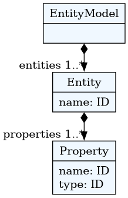
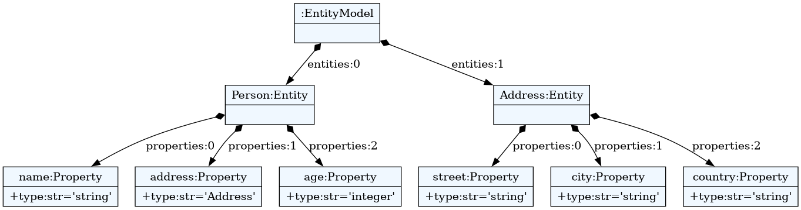
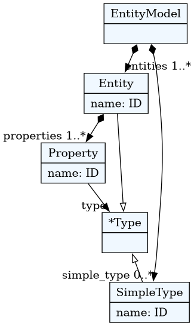
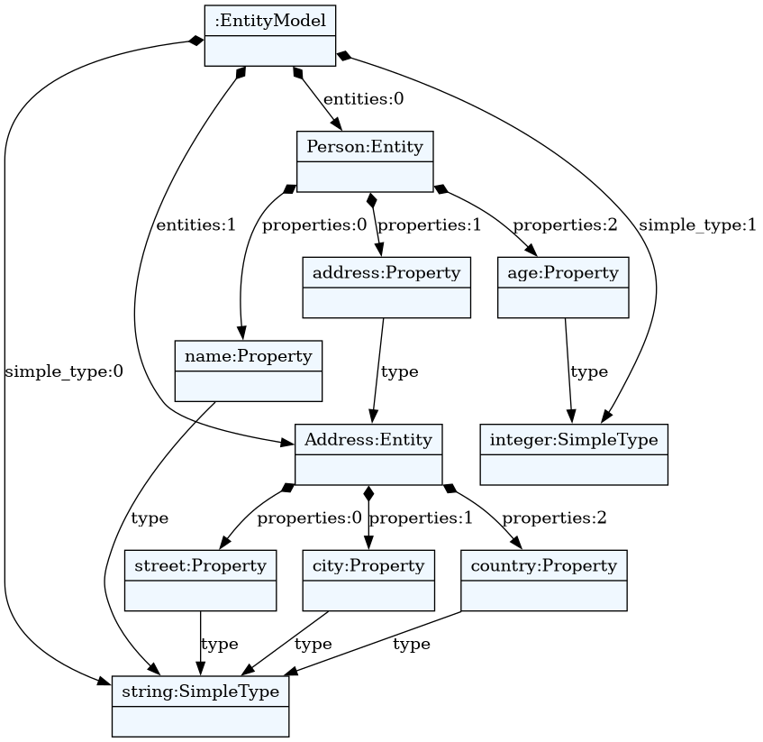

# Entity tutorial

A tutorial for building ER-like language and generating Java code.

---

## Entity language

In this example we will see how to make a simple language for data modeling.
We will use this language to generate Java source code (POJO classes).

Our main concept will be `Entity`. Each entity will have one or more
`properties`.  Each property is defined by its `name` and its `type`.

Let's sketch out a model in our language.

```
entity Person {
  name : string
  address: Address
  age: integer
}

entity Address {
  street : string
  city : string
  country : string
}
```


## The grammar

In our example we see that each entity starts with a keyword `entity`. After
that, we have a name that is the identifier and an open bracket.
Between the brackets we have properties. In textX this is written as:

```textx
Entity:
    'entity' name=ID '{'
        properties+=Property
    '}'
;
```

We can see that the `Entity` rule references `Property` rule from the
assignment. Each property is defined by the `name`, colon (`:`) and the
type's name. This can be written as:

```textx
Property:
    name=ID ':' type=ID
;
```

Now, grammar defined in this way will parse a single `Entity`. We haven't stated
yet that our model consists of many `Entity` instances.

Let's specify that. We are introducing a rule for the whole model which states
that each entity model contains one or more `entities`.

```textx
EntityModel:
    entities+=Entity
;
```

This rule must be the first rule in the textX grammar file. First rule is always
considered a `root rule`.

This grammar will parse the example model from the beginning.

At any time you can check and visualize entity meta-model and person model using
commands:

    $ textx generate entity.tx --target dot
    $ textx generate person.ent --grammar entity.tx --target dot

Given grammar in file `entity.tx` and example Person model in file
`person.ent`.

These commands will produce `entity.dot` and `person.dot` files which can be
viewed by any dot viewer or converted to e.g. PNG format using command:

    $ dot -Tpng -O *.dot

Note that [GraphViz](http://graphviz.org/) must be installed to use dot command
line utility.

Meta-model now looks like this:



While the example (Person model) looks like this:



What you see on the model diagram are actual Python objects.
It looks good, but it would be even better if a reference to `Address` from
properties was an actual Python reference, not just a value of `str` type.

This resolving of object names to references can be done automatically by textX.
To do so, we shall change our `Property` rule to be:

```textx
Property:
    name=ID ':' type=[Entity]
;
```

Now, we state that type is a reference (we are using `[]`) to an object of the `Entity`
class. This instructs textX to search for the name of the `Entity` after the
colon and when it is found to resolve it to an `Entity` instance with the same name
defined elsewhere in the model.

But, we have a problem now. There are no entities called `string` and `integer`
which we used for several properties in our model. To remedy this, we must
introduce dummy entities with those names and change `properties` attribute
assignment to be `zero or more` (`*=`) since our dummy entities will have no
attributes.

Although, this solution is possible it wouldn't be elegant at all. So let's
do something better. First, let's introduce an abstract concept called `Type`
which as the generalization of simple types (like `integer` and `string`) and
complex types (like `Entity`).

```textx
Type:
  SimpleType | Entity
;
```

This is called abstract rule, and it means that `Type` is either a `SimpleType`
or an `Entity` instance. `Type` class from the meta-model will never be
instantiated.

Now, we shall change our `Property` rule definition:

```textx
Property:
    name=ID ':' type=[Type]
;
```

And, at the end, there must be a way to specify our simple types. Let's do that
at the beginning of our model.

```textx
EntityModel:
    simple_types *= SimpleType
    entities += Entity
;
```

And the definition of `SimpleType` would be:

```textx
SimpleType:
  'type' name=ID
;
```

So, simple types are defined at the beginning of the model using the keyword `type`
after which we specify the name of the type.

Our person model will now begin with:

```
type string
type integer

entity Person {
...

```


Meta-model now looks like this:



While the example (Person model) looks like this:



But, we can make this language even better. We can define some built-in simple
types so that the user does not need to specify them for every model. This has
to be done from python during meta-model instantiation. We can instantiate
`integer` and `string` simple types and introduce them in every model
programmatically.

The first problem is how to instantiate the `SimpleType` class. textX will dynamically
create a Python class for each rule from the grammar but we do not have access
to these classes in advance.

Luckily, textX offers a way to override dynamically created classes with user
supplied ones. So, we can create our class `SimpleType` and register that class
during meta-model instantiation together with two of its instances (`integer` and
`string`).

```python
class SimpleType:
  def __init__(self, parent, name):  # remember to include parent param.
    self.parent = parent
    self.name = name
```

Now, we can make a dict of builtin objects.

```python
myobjs =  {
  'integer': SimpleType(None, 'integer'),
  'string': SimpleType(None, 'string')
}
```

And register our custom class and two builtins on the meta-model:

```python
meta = metamodel_from_file('entity.tx',
                            classes=[SimpleType],
                            builtins=myobjs)
```

Now, if we use `meta` to load our models we do not have to specify `integer` and
`string` types. Furthermore, each instance of `SimpleType` will be an instance
of our `SimpleType` class.

We, can use this custom classes support to implement any custom behaviour in
our object graph.


## Generating source code

textX doesn't impose any specific library or process for source code generation.
You can use anything you like. From the `print` function to template engines.

I highly recommend you to use some of the well-established [template
engines](https://en.wikipedia.org/wiki/Template_processor).

Here, we will see how to use [Jinja2 template engine](http://jinja.pocoo.org/)
to generate Java source code from our entity models.

First, install jinja2 using pip:

    $ pip install Jinja2

Now, for each entity in our model we will render one Java file with a pair of
getters and setters for each property.

Let's write Jinja2 template (file `java.template`):

```jinja
// Autogenerated from java.template file
class {{entity.name}} {

  
  protected {{property.type|javatype}} {{property.name}};
  

  
  public {{property.type|javatype}} get{{property.name|capitalize}}(){
    return this.{{property.name}};
  }

  public void set{{property.name|capitalize}}({{property.type|javatype}} new_value){
    this.{{property.name}} = new_value;
  }

  
}

```


Templates have static parts that will be rendered as they are, and variable parts
whose content depends on the model. Variable parts are written inside
`{{}}`. For example `{{entity.name}}` from the second line is the name of
the current entity.

The logic of rendering is controlled by `tags` written in `` (e.g. loops,
conditions).

We can see that this template will render a warning that this is auto-generated
code (it is always good to do that!). Then it will render a Java class named after
the current entity and then, for each property in the entity (please note that
we are using textX model so all attribute names come from the textX grammar) we
are rendering a Java attribute. After that, we are rendering getters and
setters.

You could notice that for rendering proper Java types we are using `|javatype`
expression. This is called `filter` in Jinja2. It works similarly to `unix` pipes.
You have an object and you pass it to some filter. Filter will transform the given
object to some other object. In this case `javatype` is a simple python function
that will transform our types (`integer` and `string`) to proper Java types
(`int` and `String`).

Now, let's see how we can put this together. We need to initialize the Jinja2
engine, instantiate our meta-model, load our model and then iterate over
the entities from our model and generate a Java file for each entity:

```python
from os import mkdir
from os.path import exists, dirname, join
import jinja2
from textx import metamodel_from_file

this_folder = dirname(__file__)


class SimpleType:
    def __init__(self, parent, name):
        self.parent = parent
        self.name = name

    def __str__(self):
        return self.name


def get_entity_mm():
    """
    Builds and returns a meta-model for Entity language.
    """
    type_builtins = {
            'integer': SimpleType(None, 'integer'),
            'string': SimpleType(None, 'string')
    }
    entity_mm = metamodel_from_file(join(this_folder, 'entity.tx'),
                                    classes=[SimpleType],
                                    builtins=type_builtins)

    return entity_mm


def main(debug=False):

    # Instantiate the Entity meta-model
    entity_mm = get_entity_mm()

    def javatype(s):
        """
        Maps type names from SimpleType to Java.
        """
        return {
                'integer': 'int',
                'string': 'String'
        }.get(s.name, s.name)

    # Create the output folder
    srcgen_folder = join(this_folder, 'srcgen')
    if not exists(srcgen_folder):
        mkdir(srcgen_folder)

    # Initialize the template engine.
    jinja_env = jinja2.Environment(
        loader=jinja2.FileSystemLoader(this_folder),
        trim_blocks=True,
        lstrip_blocks=True)

    # Register the filter for mapping Entity type names to Java type names.
    jinja_env.filters['javatype'] = javatype

    # Load the Java template
    template = jinja_env.get_template('java.template')

    # Build a Person model from person.ent file
    person_model = entity_mm.model_from_file(join(this_folder, 'person.ent'))

    # Generate Java code
    for entity in person_model.entities:
        # For each entity generate java file
        with open(join(srcgen_folder,
                      "%s.java" % entity.name.capitalize()), 'w') as f:
            f.write(template.render(entity=entity))


if __name__ == "__main__":
    main()

```

And the generated code will look like this:

```java
// Autogenerated from java.template file
class Person {

  protected String name;
  protected Address address;
  protected int age;

  public String getName(){
    return this.name;
  }

  public void setName(String new_value){
    this.name = new_value;
  }

  public Address getAddress(){
    return this.address;
  }

  public void setAddress(Address new_value){
    this.address = new_value;
  }

  public int getAge(){
    return this.age;
  }

  public void setAge(int new_value){
    this.age = new_value;
  }

}
```

```admonish
The code from this tutorial can be found in the
[examples/Entity](https://github.com/textX/textX/tree/master/examples/Entity)
folder.
```

