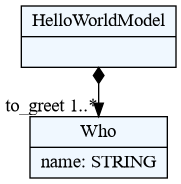
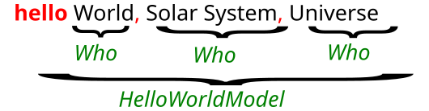
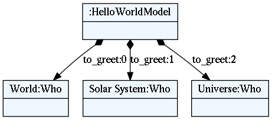

# Hello World example

This is an example of very simple Hello World like language.

---

```admonish
A `.tx` file extension is used for textX grammar. See [textX
grammar](../grammar.md) on what you can do inside a grammar file, including
[comments](../grammar.md#grammar-comments)!
```

These are the steps to build a very basic Hello World - like language.

1. Write a language description in textX (file `hello.tx`):

        HelloWorldModel:
          'hello' to_greet+=Who[',']
        ;

        Who:
          name = /[^,]*/
        ;

    Description consists of a set of parsing rules which at the same time
    describe Python classes that will be dynamically created and used to
    instantiate objects of your model.  This small example consists of two
    rules: `HelloWorldModel` and `Who`.  `HelloWorldModel` starts with the
    keyword `hello` after which a one or more `Who` object must be written
    separated by commas. `Who` objects will be parsed, instantiated and stored
    in a `to_greet` list on a `HelloWorldModel` object. `Who` objects consists
    only of its names which must be matched the regular expression rule
    `/[^,]*/` (match non-comma zero or more times). Please see [textX
    grammar](../grammar.md) section for more information on writing grammar
    rules.

2. At this point you can check and visualise meta-model using following command
   from the command line:

        $ textx generate hello.tx --target dot
        Generating dot target from models:
        /home/igor/repos/textX/textX/examples/hello_world/hello.tx
        -> /home/igor/repos/textX/textX/examples/hello_world/hello.dot
          To convert to png run "dot -Tpng -O hello.dot"

    

    You can see that for each rule from language description an appropriate
    Python class has been created. A BASETYPE hierarchy is built-in. Each
    meta-model has it.


3. Create some content (i.e. model) in your new language (``example.hello``):

        hello World, Solar System, Universe

    Your language syntax is also described by language rules from step 1.

    If we break down the text of the example model it looks like this:

    

    We see that the whole line is a `HelloWorldModel` and the parts `World`, 
    `Solar System`, and `Universe` are `Who` objects. Red coloured text is
    syntactic noise that is needed by the parser (and programmers) to recognize
    the boundaries of the objects in the text.

4. To use your models from Python first create meta-model from textX language
   description (file `hello.py`):

        from textx import metamodel_from_file
        hello_meta = metamodel_from_file('hello.tx')

5. Than use meta-model to create models from textual description:

        hello_model = hello_meta.model_from_file('example.hello')

    Textual model `example.hello` will be parsed and transformed to plain Python
    objects. Python classes of the created objects are those defined by the
    meta-model. Returned object `hello_model` will be a reference to the root of
    the model, i.e. the object of class `HelloWorldModel`. You can use the model
    as any other Python object. For example:
    
        print("Greeting", ", ".join([to_greet.name
                                    for to_greet in hello_model.to_greet]))

6. You can optionally export model to `dot` file to visualize it. Run following
   from the command line:
   
        $ textx generate example.hello --grammar hello.tx --target dot
        Generating dot target from models:
        /home/igor/repos/textX/textX/examples/hello_world/example.hello
        -> /home/igor/repos/textX/textX/examples/hello_world/example.dot
          To convert to png run "dot -Tpng -O example.dot"

    

    This is an object graph automatically constructed from `example.hello` file.

    We see that each `Who` object is contained in the python attribute
    `to_greet` of list type which is defined by the grammar.

7. Use your model: interpret it, generate code … It is a plain Python
   graph of objects with plain attributes!


```admonish
Try out a [complete tutorial](robot.md) for building a simple robot language.
```

