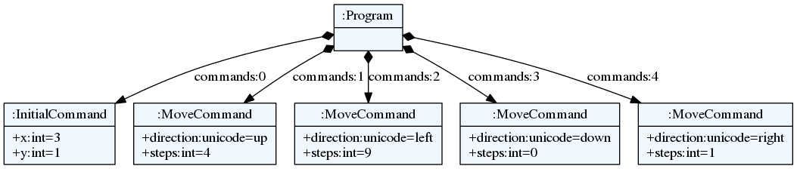

# Robot tutorial

In this tutorial we will build a simple robot language to demonstrate
the basic workflow when working with textX.

---

## Robot language

When building a DSL we should first do a domain analysis, to see what concepts
do we have and what are their relationships and constraints. In the following
paragraph a short analysis is done. Important concepts are emphasized.

In this case we want an imperative language that should define `robot` movement
on the imaginary grid. Robot should `move` in four base `direction`. We will
call these directions `up, down, left` and `right` (you could use north, south,
west and east if you like). Additionally, we shall have a robot coordinate given
in x, y `position`. For simplicity, our robot can move in discrete `steps`. In
each movement robot can move by 1 or more steps but in the same direction.
Coordinate is given as a pair of integer numbers. Robot will have an `initial
position`. If not given explicitly it is assumed that position is `(0, 0)`.


So, lets build a simple robot language.


## Grammar

First, we need to define a grammar for the language. In textX the grammar will
also define a meta-model (a.k.a. abstract syntax) for the language which can be
visualized and be used as a part of the documentation.

Usually we start by outlining some program in the language we are building.

Here is an example *program* on robot language:

    begin
        initial 3, 1
        up 4
        left 9
        down
        right 1
    end

We have `begin` and `end` keywords that define the beginning and end of the
program. In this case we could do without these keywords but lets have it to
make it more interesting.

In between those two keywords we have a sequence of instruction. First
instruction will position our robot at coordinate `(3, 1)`. After that robot
will move `up 4 steps`, `left 9 steps`, `down 1 step` (1 step is the default)
and finally `1 step to the right`.

Lets start with grammar definition. We shall start in a top-down manner so lets
first define a program as a whole.

    Program:
      'begin'
        commands*=Command
      'end'
    ;


Here we see that our program is defined with sequence of:

* string match (`'begin'`),
* zero or more assignment to `commands` attribute,
* string match (`'end'`).

String matches will require literal strings given at the begin and end of
program. If this is not satisfied a syntax error will be raised. This whole rule
(`Program`) will create a class with the same name in the meta-model. Each
program will be an instance of this class. `commands` assignment will result in
a python attribute `commands` on the instance of `Program` class. This attribute
will be of Python `list` type (because `*=` assignment is used).  Each element
of this list will be a specific command.

Now, we see that we have different types of commands. First command has two
parameters and it defines the robot initial position. Other commands has one or
zero parameters and define the robot movement.

To state that some textX rule is specialised in 2 or more rules we use an
abstract rule. For `Command` we shall define two specializations:
`InitialCommand` and `MoveCommand` like this:

    Command:
      InitialCommand | MoveCommand
    ;

Abstract rule is given as ordered choice of other rules. This can be read as
_Each command is either a InitialCommand or MoveCommand_.


Lets now define command for setting initial position.

    InitialCommand:
      'initial' x=INT ',' y=INT
    ;

This rule specifies a class `InitialCommand` in the meta-model. Each initial
position command will be an instance of this class.

So, this command should start with the keyword `initial` after which we give an
integer number (base type rule `INT` - this number will be available as
attribute `x` on the `InitialCommand` instance), than a separator `,` is
required after which we have `y` coordinate as integer number (this will be
available as attribute `y`). Using base type rule `INT` matched number from
input string will be automatically converted to python type `int`.

Now, lets define a movement command. We know that this command consists of
direction identifier and optional number of steps (if not given the default will
be 1).

    MoveCommand:
      direction=Direction (steps=INT)?
    ;

So, the movement command model object will have two attributes.
`direction` attribute will define one of the four possible directions and
`steps` attribute will be an integer that will hold how many steps a robot
will move in given direction. Steps are optional so if not given in the program
it will still be a correct syntax. Notice, that the default of 1 is not
specified in the grammar. The grammar deals with syntax constraints. Additional
semantics will be handled later in model/object processors (see below).

Now, the missing part is `Direction` rule referenced from the previous rule.
This rule will define what can be written as a direction.  We will define this
rule like this:

    Direction:
      "up"|"down"|"left"|"right"
    ;

This kind of rule is called a *match rule*. This rule does not result in a new
object. It consists of ordered choice of simple matches (string, regex), base
type rules (INT, STRING, BOOL...) and/or other match rule references.

The result of this match will be assigned to the attribute from which it was
referenced. If base type was used it will be converted in a proper python type.
If not, it will be a python string that will contain the text that was matched
from the input.

In this case a one of 4 words will be matched and that string will be assigned
to the `direction` attribute of the `MoveCommand` instance.

The final touch to the grammar is a definition of the comment rule. We want to
comment our robot code, right?

In textX a special rule called `Comment` is used for that purpose.
Lets define a C-style single line comments.

    Comment:
      /\/\/.*$/
    ;

Our grammar is done. Save it in `robot.tx` file. The content of this file
should now be:

    Program:
      'begin'
        commands*=Command
      'end'
    ;

    Command:
      InitialCommand | MoveCommand
    ;

    InitialCommand:
      'initial' x=INT ',' y=INT
    ;

    MoveCommand:
      direction=Direction (steps=INT)?
    ;

    Direction:
      "up"|"down"|"left"|"right"
    ;

    Comment:
      /\/\/.*$/
    ;

Notice that we have not constrained initial position command to be specified
just once on the beginning of the program. This basically means that this
command can be given multiple times throughout the program. I will leave as an
exercise to the reader to implement this constraint.

Next step during language design is meta-model visualization. It is usually
easier to comprehend our language if rendered graphically. To do so we use
excellent [GraphViz](http://www.graphviz.org/) software package and its DSL for
graph specification called *dot*. It is a textual language for visual graph
definition.

Lets check our meta-model and export it to the dot language.

    $ textx generate robot.tx --target dot
    Generating dot target from models:
    /home/igor/repos/textX/textX/examples/robot/robot.tx
    -> /home/igor/repos/textX/textX/examples/robot/robot.dot
      To convert to png run "dot -Tpng -O robot.dot"

`dot` file can be opened with dot viewer (there are many to choose from) or
transformed with `dot` tool to raster or vector graphics.

For example:

    $ dot -Tpng -O robot.dot

This command will create `png` image out of `dot` file.


## Instantiating meta-model

In order to parse our models we first need to construct a meta-model. A
textX meta-model is a Python object that contains all classes that can be
instantiated in our model. For each grammar rule a class is created.
Additionally, meta-model contains a parser that knows how to parse input
strings. From parsed input (parse tree) meta-model will create a model.

Meta-models are created from our grammar description, in this case
`robot.tx` file. Open `robot.py` Python file and write following:

```python
from textx import metamodel_from_file
robot_mm = metamodel_from_file('robot.tx')
```

```admonish
This meta-model can be used to parse multiple models.
```

## Instantiating model

Now, when we have our meta-model we can parse models from strings or external
textual files. Extend your `robot.py` with:

```python
robot_model = robot_mm.model_from_file('program.rbt')
```

This command will parse the file `program.rbt` and construct our robot model.
If this file does not match our language a syntax error will be raised on the
first error encountered.

In the same manner as meta-model visualization we can visualize our model too.

    $ textx generate program.rbt --grammar robot.tx --target dot
    Generating dot target from models:
    /home/igor/repos/textX/textX/examples/robot/program.rbt
    -> /home/igor/repos/textX/textX/examples/robot/program.dot
      To convert to png run "dot -Tpng -O program.dot"

This will create `program.dot` file that can be visualized using proper viewer
or transformed to image.

    $ dot -Tpng -O program.dot

For the robot program above we should get an image like this:




## Interpreting model

When we have successfully parsed and loaded our model/program (or mogram or
prodel ;) ) we can do various stuff. Usually what would you like to do is to
translate your program to some other language (Java, Python, C#, Ruby,...) or
you could build an interpreter that will evaluate/interpret your model directly.
Or you could analyse your model, extract informations from it etc. It is up to
you to decide.

We will show here how to build a simple interpreter that will start the robot
from the initial position and print the position of the robot after each
command.

Lets imagine that we have a robot that understands our language. In your
`robot.py` file add:

    class Robot:

        def __init__(self):
            # Initial position is (0,0)
            self.x = 0
            self.y = 0

        def __str__(self):
            return f"Robot position is {self.x}, {self.y}."

Now, our robot will have an `interpret` method that accepts our robot model and
runs it. At each step this method will update the robot position and print it.

    def interpret(self, model):

        # model is an instance of Program
        for c in model.commands:

            if c.__class__.__name__ == "InitialCommand":
                print(f"Setting position to: {c.x}, {c.y}")
                self.x = c.x
                self.y = c.y
            else:
                print(f"Going {c.direction} for {c.steps} step(s).")

                move = {
                    "up": (0, 1),
                    "down": (0, -1),
                    "left": (-1, 0),
                    "right": (1, 0)
                }[c.direction]

                # Calculate new robot position
                self.x += c.steps * move[0]
                self.y += c.steps * move[1]

            print(self)

Now lets give our `robot_model` to `Robot` instance and see what happens.

```python
robot = Robot()
robot.interpret(robot_model)
```

You should get this output:

    Setting position to: 3, 1
    Robot position is 3, 1.
    Going up for 4 step(s).
    Robot position is 3, 5.
    Going left for 9 step(s).
    Robot position is -6, 5.
    Going down for 0 step(s).
    Robot position is -6, 5.
    Going right for 1 step(s).
    Robot position is -5, 5.

It is *almost* correct. We can see that down movement is for 0 steps because we
have not defined the steps for `down` command and haven't done anything yet to
implement default of 1.

The best way to implement default value for step is to use so called [object
processor](../metamodel.md#object-processors) for `MoveCommand`.
Object processor is a callable that gets called whenever textX parses and
instantiates an object of particular class. Use `register_obj_processors`
method on meta-model to register callables/processors for classes your wish to
process in some way immediately after instantiation.

Lets define our processor for `MoveCommand` in `robot.py` file.

```python
def move_command_processor(move_cmd):

  # If steps is not given, set it do default 1 value.
  if move_cmd.steps == 0:
    move_cmd.steps = 1
```

Now, register this processor on meta-model. After meta-model construction add a
line for registration.

```python
robot_mm.register_obj_processors({'MoveCommand': move_command_processor})
```

`register_obj_processors` accepts a dictionary keyed by class name. The
values are callables that should handle instances of the given class.

If you run robot interpreter again you will get output like this:

    Setting position to: 3, 1
    Robot position is 3, 1.
    Going up for 4 step(s).
    Robot position is 3, 5.
    Going left for 9 step(s).
    Robot position is -6, 5.
    Going down for 1 step(s).
    Robot position is -6, 4.
    Going right for 1 step(s).
    Robot position is -5, 4.

And now our robot behaves as expected!

```admonish
The code from this tutorial can be found in the
[examples/robot](https://github.com/textX/textX/tree/master/examples/robot)
folder.

Next, you can read [the Entity tutorial](entity.md) where you can see how to
generate source code from your models.
```


