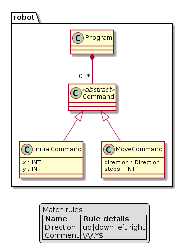
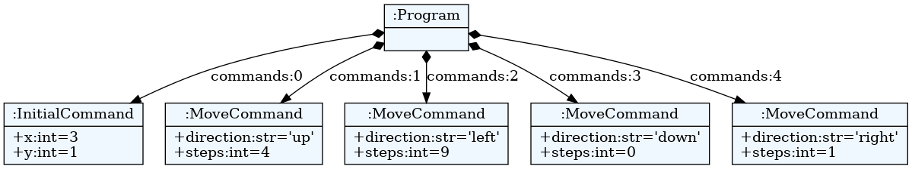
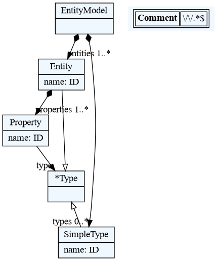
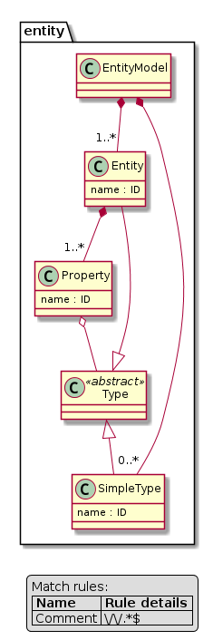

# Visualization

A meta-model, model and parse-tree can be exported to dot files ([GraphViz]) for
visualization. Module `textx.export` contains functions `metamodel_export` and
`model_export` that can export meta-model and model to dot files respectively.
But, it is usually more convenient to produce visualization using the [`textx`
command](textx_command.md).

If [debugging](debugging.md) is enabled, meta-model, model and parse trees will
automatically get exported to dot.

Dot files can be viewed by dot viewers. There are quite a few dot viewers freely
available (e.g. [xdot], [ZGRViewer]).

Alternatively, dot files can be converted to image formats using `dot` command.
For more info see [this SO
thread](http://stackoverflow.com/questions/1494492/graphviz-how-to-go-from-dot-to-a-graph).

In addition to [GraphViz] we also support [PlantUML] as target for our exports
(see [textx command/tool](textx_command.md)). You can copy-paste the exported
file content online on the [PlantUML] website to visualize it. The PlantUML Tool
is a JAR file (Java) which runs on various platforms. Many Linux distributions
have this tool included (e.g. Ubuntu: `apt install platuml`).


## Producing (meta)model visualizations using the `textx` command

This section describes how to use [`textx` command and registered
generators](textx_command.md) to produce model and meta-model visualizations.

Visualizations of models and meta-models are implemented by registering
generators from `textX` (for meta-models) or `any` (for all models) to `dot` or
`PlantUML` file format. Several of these generators are provided by textX. You
can list them by [list-generators command](registration.md#listing-generators):

```
$ textx list-generators
textX -> dot         textX               Generating dot visualizations from textX grammars
textX -> PlantUML    textX               Generating PlantUML visualizations from textX grammars
any -> dot           textX               Generating dot visualizations from arbitrary models
flow-dsl -> PlantUML flow-codegen        Generating PlantUML visualization from flow-dsl
```

You see that we have two generators from `textX` language (i.e. textX grammar
language) registered by the `textX` project. The first as a target uses `dot`
and the second uses `PlantUML`. These generators will produce `dot` (part of
[GraphViz]) or `pu` ([PlantUML]) file respectively.

Also, you can see that there is `any` -> `dot` generator. This generator can be
applied to any model and will produce `dot` output.

You can also see in this example that we have a specific visualization for
language `flow-dsl` that produces `PlantUML` code. You can register visualizers
for your own language by registering a generator from your language to some
output that represents visual rendering. Also, you could provide rendering to
some different format for all models (`any`) or for textX grammars. See the
[registration/discovery feature](registration.md) on how to do that.

```admonish
Generators that produce visualization are by no means different from any other
generators (e.g. those that would produce Java or Python code).
```

Here is an example on how to produce the same visualization described in section
[Visualization](visualization.md) (see the [robot
example](https://github.com/textX/textX/tree/master/examples/robot)).

```
$ textx generate robot.tx --target dot
Generating dot target from models:
/home/igor/repos/textX/textX/examples/robot/robot.tx
-> /home/igor/repos/textX/textX/examples/robot/robot.dot
   To convert to png run "dot -Tpng -O robot.dot"
```

Now you can view `dot` file using some of available viewers. For example, if you
install [xdot]:

```
$ xdot robot.dot
```

or convert it to some other graphical format ([GraphViz] is needed):

```
$ dot -Tpng -O robot.dot
```

and you will get `robot.dot.png` that looks like this:


You can also generate [PlantUML] output from the grammar files:

```
$ textx generate robot.tx --target plantuml
Generating plantuml target from models:
/home/igor/repos/textX/textX/examples/robot/robot.tx
-> /home/igor/repos/textX/textX/examples/robot/robot.pu
To convert to png run 'plantuml /home/igor/repos/textX/textX/examples/robot/robot.pu'

```

This will produce file `robot.pu`. Now convert it to `robot.png` by ([PlantUML]
must be installed and accessible on path):

```
$ plantuml robot.pu

```

The produced `robot.png` image will look like this:




```admonish tip
PlantUML generator accepts additional parameter `linetype` which controls
the style of lines in the diagram. Possible values are `ortho` and
`polyline`. For example:

    $ textx generate robot.tx --target plantuml --linetype ortho
```


Similarly you can generate output from any model. For example:

```
$ textx generate program.rbt --grammar robot.tx --target dot
Generating dot target from models:
/home/igor/repos/textX/textX/examples/robot/program.rbt
-> /home/igor/repos/textX/textX/examples/robot/program.dot
   To convert to png run "dot -Tpng -O program.dot"

```

In this example we had to supply `--grammar` option to `generate` command as the
`robot` language is not registered by the [registration API](registration.md).
If we had the robot language registered, meta-model could be discovered by the
file extension.

We could as usual visualize the `dot` file by some of the available viewers or
transform it to `png` format. The produced image will look like this:




```admonish
[PlantUML] output is not yet available for model files.
```


## Visualize meta-models programmatically


To visualize a meta-model programmatically do (see [Entity
example](https://github.com/textX/textX/tree/master/examples/Entity)):

```python
from textx import metamodel_from_file
from textx.export import metamodel_export

entity_mm = metamodel_from_file('entity.tx')

metamodel_export(entity_mm, 'entity.dot')
```

`entity.dot` file will be created. You can visualize this file by using various
dot viewers or convert it to various image formats using the `dot` tool.

```
$ dot -Tpng -O entity.dot
```

The following image is generated:



Alternatively, you can also specify an alternative renderer to export your meta
model for the [PlantUML] tool.

```python
from textx import metamodel_from_file
from textx.export import metamodel_export, PlantUmlRenderer

entity_mm = metamodel_from_file('entity.tx')

metamodel_export(entity_mm, 'entity.pu',renderer=PlantUmlRenderer())
```

`entity.pu` file will be created. You can convert it to various image formats
using the `plantuml` tool.

```
$ plantuml -Tpng entity.pu
```

The following image is generated:




## Visualize models programmatically

Similarly to meta-model visualization, you can also visualize your models (see [Entity
example](https://github.com/textX/textX/tree/master/examples/Entity)).

```python
from textx.export import model_export

person_model = entity_mm.model_from_file('person.ent')

model_export(person_model, 'person.dot')
```


Convert this `dot` file to `png` with:

```
$ dot -Tpng -O person.dot
```

The following image is generated:


[GraphViz]: http://www.graphviz.org/
[xdot]: https://github.com/jrfonseca/xdot.py
[ZGRViewer]: http://zvtm.sourceforge.net/zgrviewer.html
[PlantUML]: http://plantuml.com/
