# All grammars (*.tx)
## rhapsody.tx
 * source: ../../tests/perf/rhapsody.tx
 * basename: tests_perf_rhapsody

		RhapsodyModel:
		    header= /[^\n]*/
		    root=Object
		;
		
		Object:
		    '{' name=ID
		        properties+=Property
		    '}'
		;
		
		Property:
		    '-' name=ID '=' (values=Value (';'? !('-'|'}') values=Value)*)? ';'?
		;
		
		Value:
		     STRING | INT | FLOAT | GUID | Object | ID
		;
		
		GUID:
		    'GUID' value=/[a-f0-9]*-[a-f0-9]*-[a-f0-9]*-[a-f0-9]*-[a-f0-9]*/
		;
		
		Comment:
		    /\/\/.*$/
		;

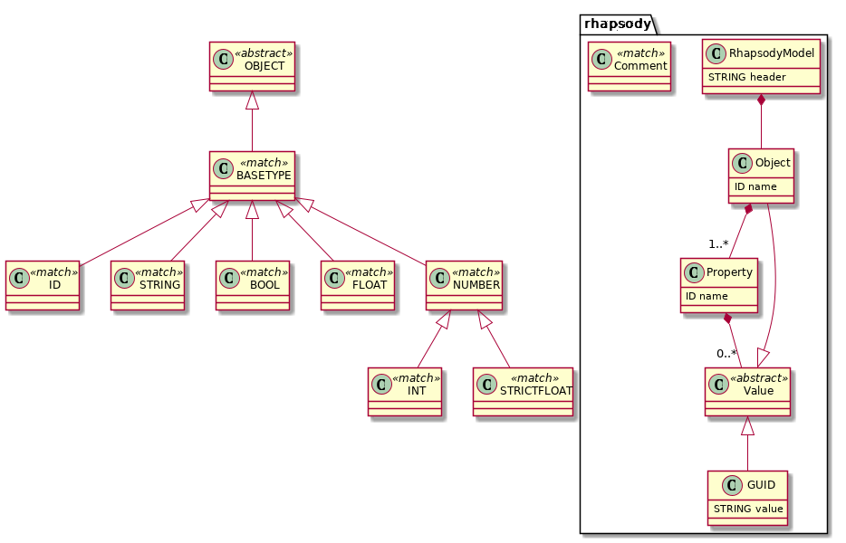
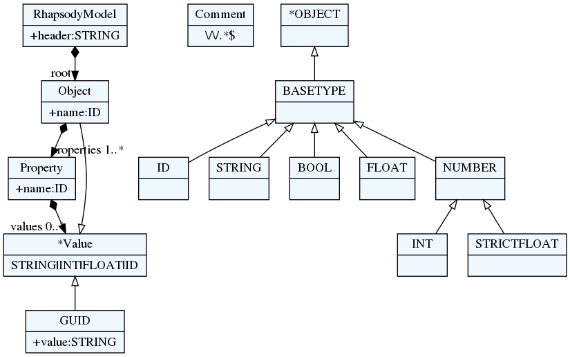

## Components.tx
 * source: ../../tests/functional/test_scoping/components_model1/Components.tx
 * basename: tests_functional_test_scoping_components_model1_Components

		Model:
		        packages*=Package
		;
		
		Package:
		        'package' name=ID '{'
		        (
		        components+=Component
		        |
		        instances+=Instance
		        |
		        connections+=Connection
		        |
		        packages+=Package
		        |
		        interfaces+=Interface
		        )*
		        '}'
		;
		
		Interface: 'interface' name=ID;
		
		// A component defines something with in/out ports
		// A component can inherit form another component --> lookup with inheritance
		Component:
		    'component' name=ID ('extends' extends+=[Component|FQN][','])? '{'
		        slots*=Slot
		    '}'
		;
		
		Slot: SlotIn|SlotOut;
		
		SlotIn:
		    'in' name=ID
		    ('(' 'format' formats+=[Interface|FQN][','] ')')?
		;
		SlotOut:
		    'out' name=ID
		    ('(' 'format' formats+=[Interface|FQN][','] ')')?
		;
		
		// An instance of a component can be connected to other instances
		// always with portout --> portin
		Instance:
		    'instance' name=ID ':' component=[Component|FQN] ;
		
		// A connection connects two instances
		// --> lookup of ports to corresponding component belonging to the instance
		// --> lookup of ports with inheritance
		Connection:
		    'connect'
		      from_inst=[Instance|ID] '.' from_port=[SlotOut|ID]
		    'to'
		      to_inst=[Instance|ID] '.' to_port=[SlotIn|ID]
		;
		
		FQN: ID+['.'];
		Comment: /\/\/.*$/;

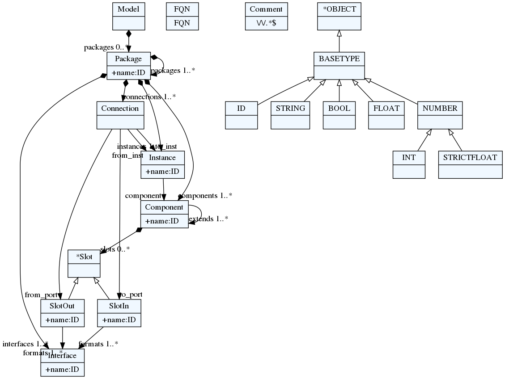

## Components.tx
 * source: ../../tests/functional/test_scoping/components_model2/Components.tx
 * basename: tests_functional_test_scoping_components_model2_Components

		Model:
		        packages*=Package
		;
		
		Package:
		        'package' name=ID '{'
		        (
		        components+=Component
		        |
		        instances+=Instance
		        |
		        connections+=Connection
		        |
		        packages+=Package
		        )*
		        '}'
		;
		
		// A component defines something with in/out ports
		// A component can inherit form another component --> lookup with inheritance
		Component:
		    'component' name=ID ('extends' extends=[Component|FQN])? '{'
		        slots*=Slot
		    '}'
		;
		
		Slot: SlotIn|SlotOut;
		
		SlotIn:
		    'in' name=ID
		;
		SlotOut:
		    'out' name=ID
		;
		
		// An instance of a component can be connected to other instances
		// always with portout --> portin
		Instance:
		    'instance' name=ID ':' component=[Component|FQN] ;
		
		// A connection connects two instances
		// --> lookup of ports to corresponding component belonging to the instance
		// here (compared to compoennts_model1) we Postponed slots, since the objects are
		//   resolved later...
		Connection:
		    'connect'
		      from_port=[SlotOut|ID] 'from' from_inst=[Instance|ID]
		    '->'
		      to_port=[SlotIn|ID] 'from' to_inst=[Instance|ID]
		;
		
		FQN: ID+['.'];
		Comment: /\/\/.*$/;

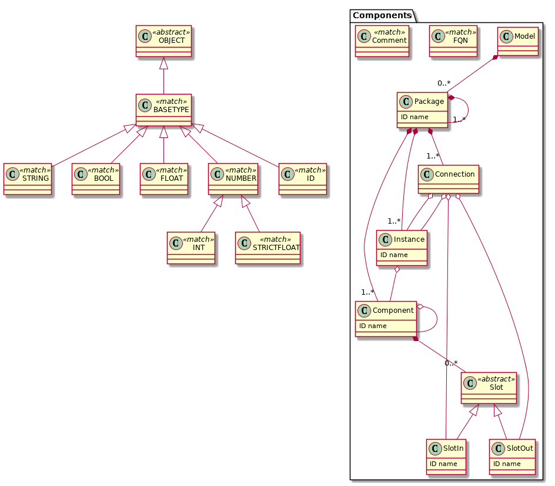
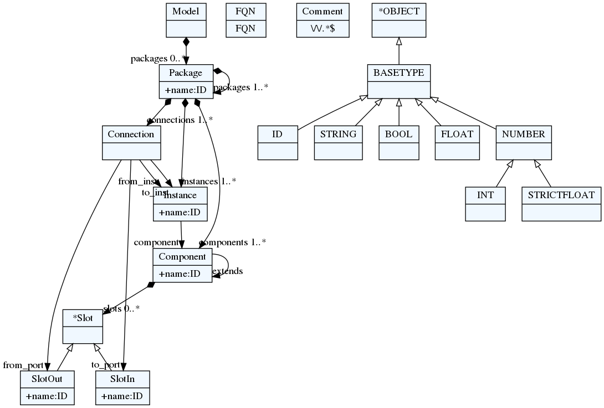

## Ingredient.tx
 * source: ../../tests/functional/test_scoping/metamodel_provider2/Ingredient.tx
 * basename: tests_functional_test_scoping_metamodel_provider2_Ingredien

		import Base
		
		Model: ingredientTypes+=IngredientType+;

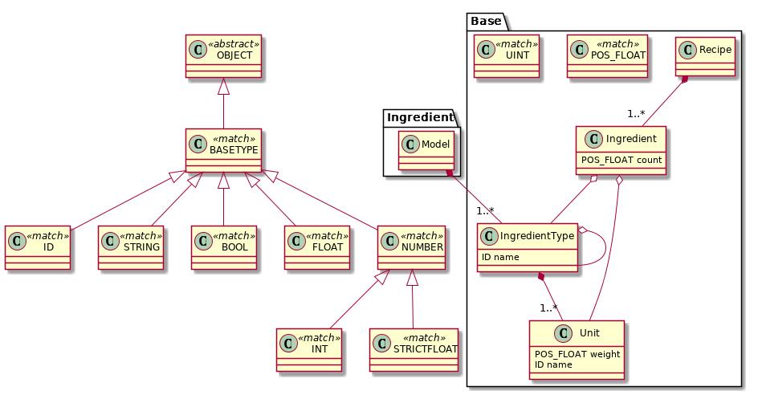
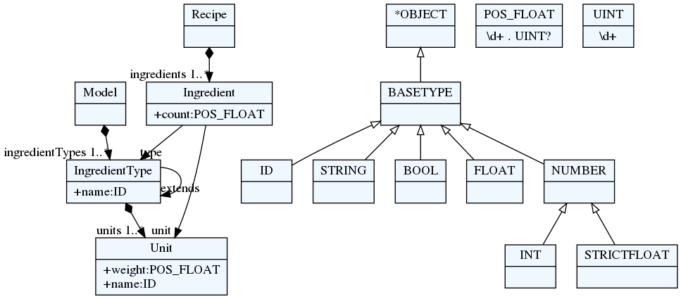

## Base.tx
 * source: ../../tests/functional/test_scoping/metamodel_provider2/Base.tx
 * basename: tests_functional_test_scoping_metamodel_provider2_Base

		Recipe:
		    ingredients+=Ingredient+
		;
		
		Ingredient: "-" count=POS_FLOAT unit=[Unit] type=[IngredientType];
		
		IngredientType: "ingredient" name=ID ("inherits" "from" extends=[IngredientType])? "{"
		    units+=Unit*
		"}"
		;
		
		Unit: "unit" weight=POS_FLOAT name=ID;
		
		POS_FLOAT: UINT("."UINT)?;
		UINT: /\d+/;

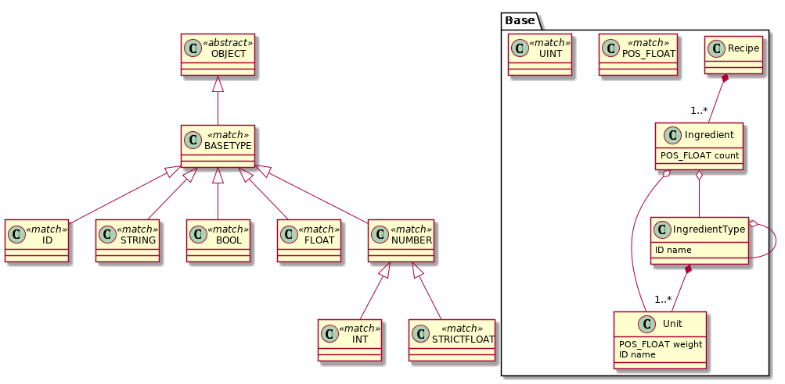
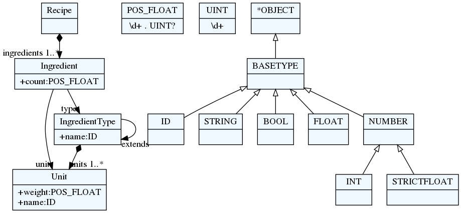

## Recipe.tx
 * source: ../../tests/functional/test_scoping/metamodel_provider2/Recipe.tx
 * basename: tests_functional_test_scoping_metamodel_provider2_Recipe

		import Base
		
		Model: recipe=Recipe;
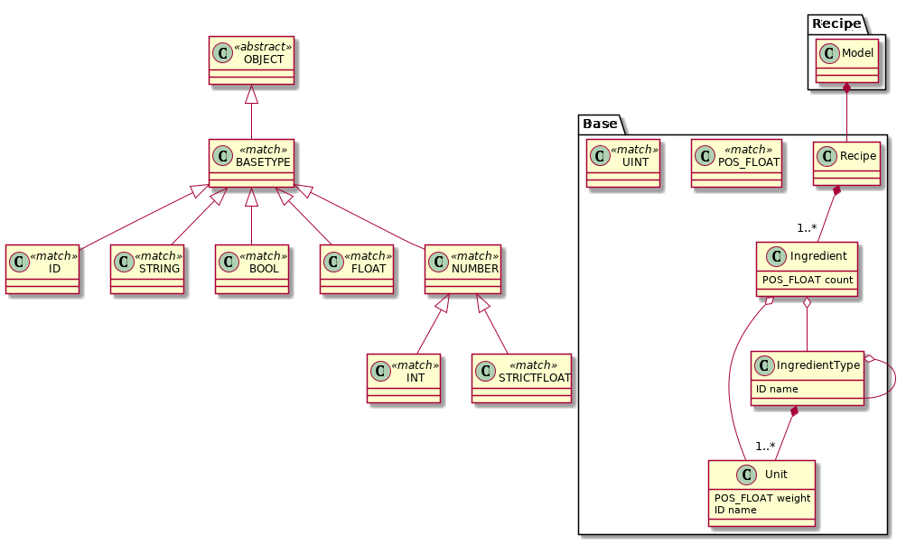
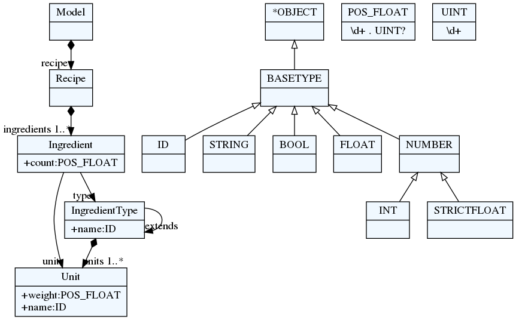

## Interface.tx
 * source: ../../tests/functional/test_scoping/interface_model2/Interface.tx
 * basename: tests_functional_test_scoping_interface_model2_Interface

		Model:
		        packages*=Package
		;
		
		Package:
		        'package' name=ID '{'
		        (
		        interfaces+=Interface
		        |
		        packages+=Package
		        |
		        raw_types+=RawType
		        )*
		        '}'
		;
		
		RawType:
		    'type' name=ID '{'
		    '}'
		;
		Interface:
		    'interface' name=ID '{'
		        attributes*=Attribute
		    '}'
		;
		
		Attribute: RawTypeAttribute|EmbeddedAttribute;
		
		RawTypeAttribute:
		        ref=[RawType|FQN] name=ID ';'
		;
		EmbeddedAttribute:
		        '->' ref=[Interface|FQN] name=ID ';'
		;
		
		FQN: ID+['.'];
		Comment: /\/\/.*$/;

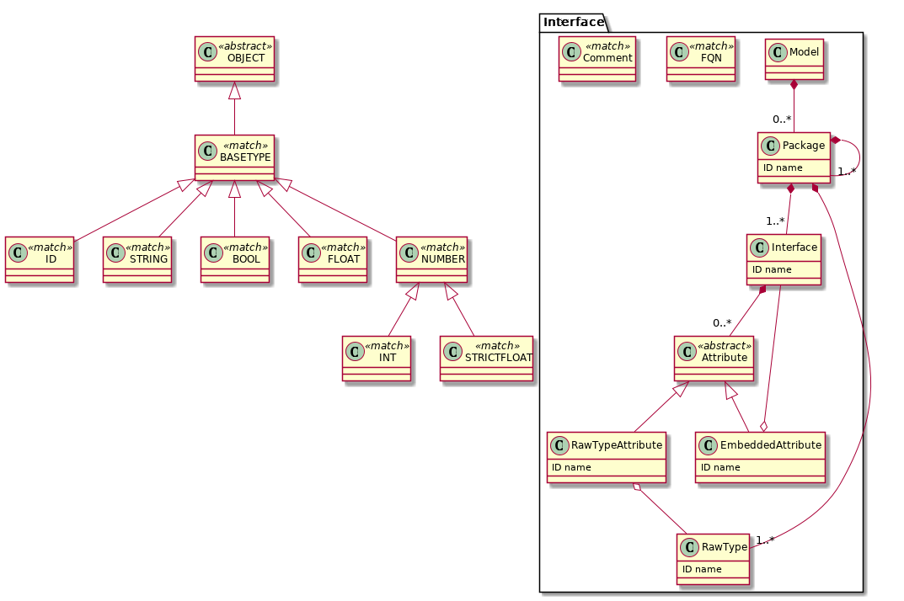
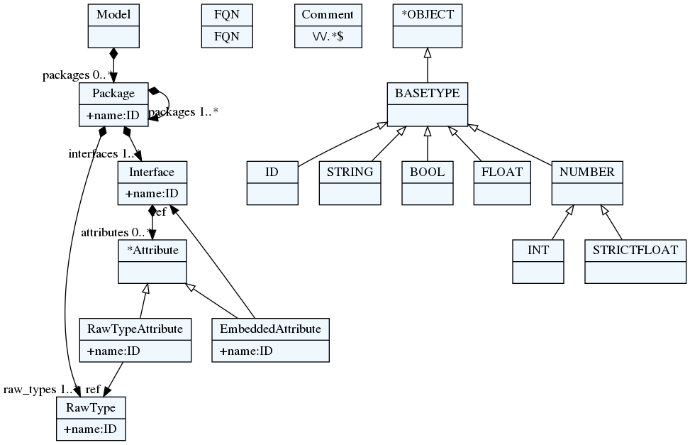

## Users.tx
 * source: ../../tests/functional/test_scoping/metamodel_provider/Users.tx
 * basename: tests_functional_test_scoping_metamodel_provider_Users

		import Components
		
		Model:
		    imports+=Import+
		    users+=User+
		;
		
		User:
		    "user" name=ID "uses" instance=[Instance|FQN]
		;
		
		Import: 'import' importURI=STRING;

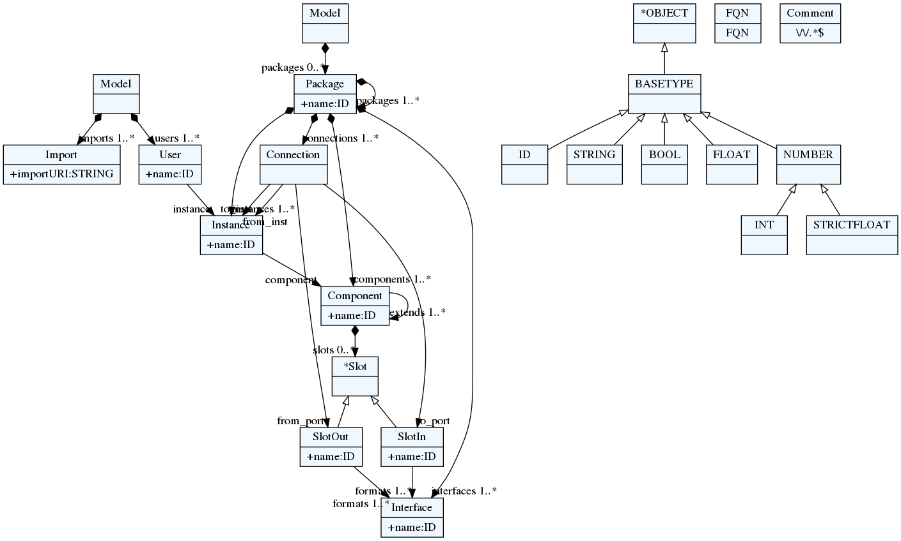

## Components.tx
 * source: ../../tests/functional/test_scoping/metamodel_provider/Components.tx
 * basename: tests_functional_test_scoping_metamodel_provider_Components

		Model:
		        packages*=Package
		;
		
		Package:
		        'package' name=ID '{'
		        (
		        components+=Component
		        |
		        instances+=Instance
		        |
		        connections+=Connection
		        |
		        packages+=Package
		        |
		        interfaces+=Interface
		        )*
		        '}'
		;
		
		Interface: 'interface' name=ID;
		
		// A component defines something with in/out ports
		// A component can inherit form another component --> lookup with inheritance
		Component:
		    'component' name=ID ('extends' extends+=[Component|FQN][','])? '{'
		        slots*=Slot
		    '}'
		;
		
		Slot: SlotIn|SlotOut;
		
		SlotIn:
		    'in' name=ID
		    ('(''''format' formats+=[Interface|FQN][','] ')')?
		;
		SlotOut:
		    'out' name=ID
		    ('(' '''format' formats+=[Interface|FQN][','] ')')?
		;
		
		// An instance of a component can be connected to other instances
		// always with portout --> portin
		Instance:
		    'instance' name=ID ':' component=[Component|FQN] ;
		
		// A connection connects two instances
		// --> lookup of ports to corresponding component belonging to the instance
		// --> lookup of ports with inheritance
		Connection:
		    'connect'
		      from_inst=[Instance|ID] '.' from_port=[SlotOut|ID]
		    'to'
		      to_inst=[Instance|ID] '.' to_port=[SlotIn|ID]
		;
		
		FQN: ID+['.'];
		Comment: /\/\/.*$/;

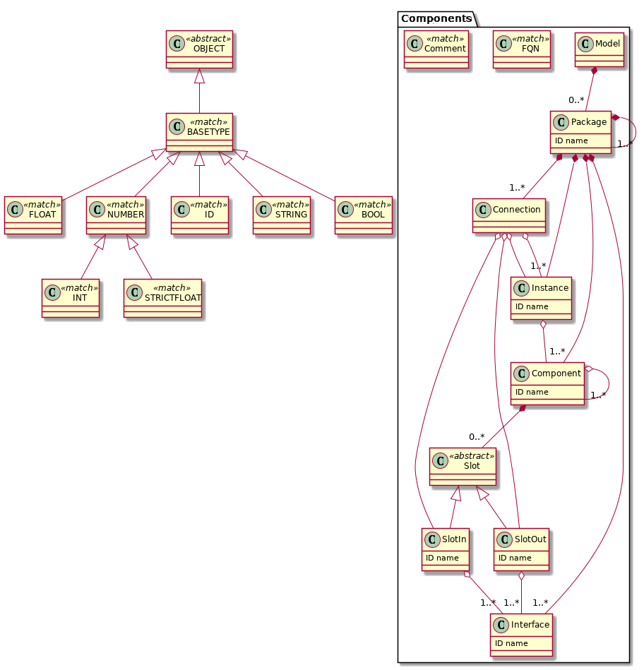

## Interface.tx
 * source: ../../tests/functional/test_scoping/interface_model1/Interface.tx
 * basename: tests_functional_test_scoping_interface_model1_Interface

		Model:
		        imports*=Import
		        packages*=Package
		;
		
		Package:
		        'package' name=ID '{'
		        (
		        interfaces+=Interface
		        |
		        packages+=Package
		        |
		        raw_types+=RawType
		        )*
		        '}'
		;
		
		RawType:
		    'type' name=ID '{'
		    '}'
		;
		Interface:
		    'interface' name=ID '{'
		        attributes*=Attribute
		    '}'
		;
		
		Attribute: RawTypeAttribute|EmbeddedAttribute;
		
		RawTypeAttribute:
		        ref=[RawType|FQN] name=ID ';'
		;
		EmbeddedAttribute:
		        '->' ref=[Interface|FQN] name=ID ';'
		;
		
		FQN: ID+['.'];
		Import: 'import' importURI=STRING;
		Comment: /\/\/.*$/;

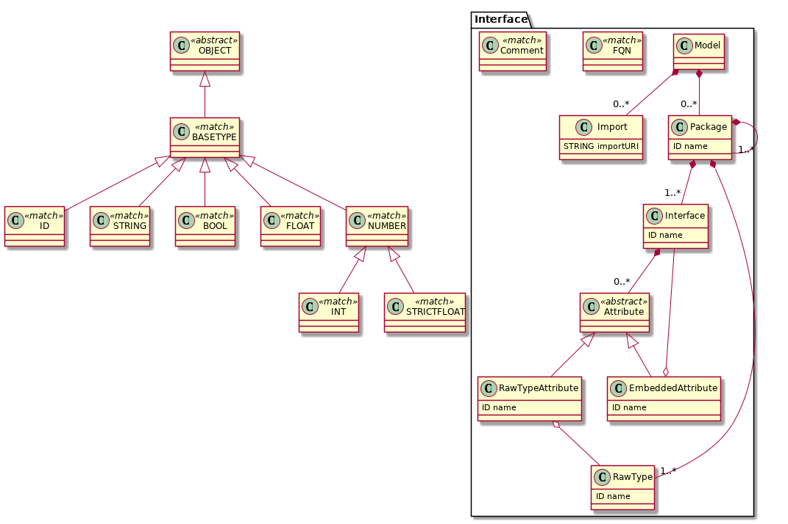
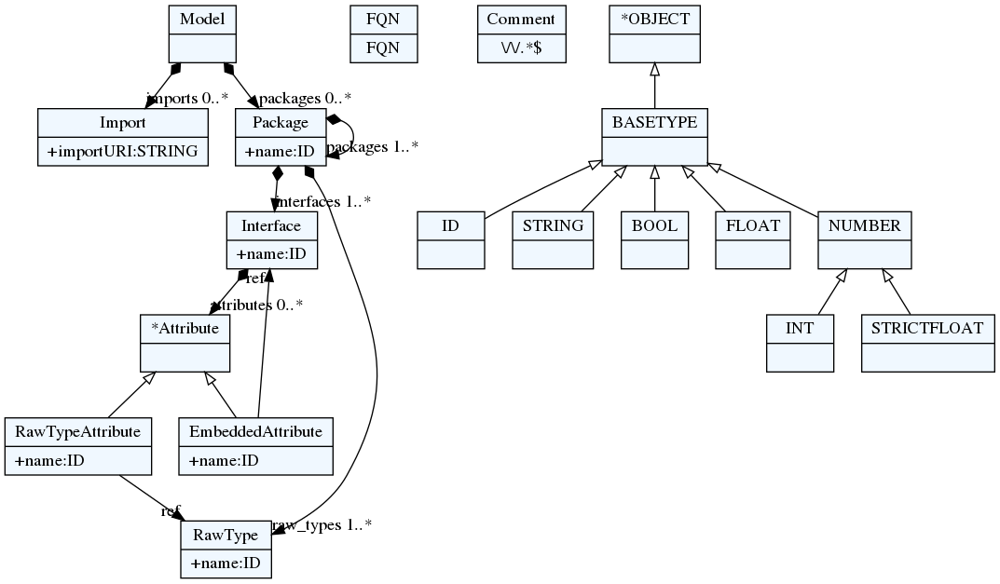

## task_specification.tx
 * source: ../../tests/functional/test_scoping/issue66/task_specification.tx
 * basename: tests_functional_test_scoping_issue66_task_specification

		Model:
		    (
		    imports*=Import
		    'skills' '{'  skills+=Skill '}'
		    )|
		    (skill_types+=SkillType)
		;
		
		Skill: 'skill' name=ID '{'
		    'type' '=' type=[SkillType]
		    ('properties' '{' properties+=Property '}')?
		'}'
		;
		
		SkillType: 'skill_type' name=ID;
		Property:  name=ID ':' value=BASETYPE ;
		Import: 'import' importURI=STRING;

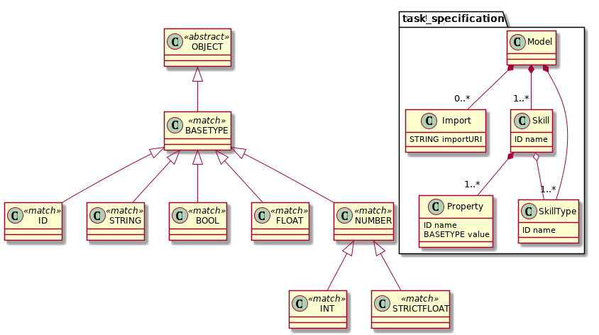
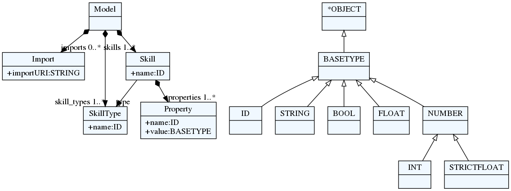

## Users.tx
 * source: ../../tests/functional/test_scoping/metamodel_provider_utf-16-le/Users.tx
 * basename: tests_functional_test_scoping_metamodel_provider_utf-16-le_Users

		import Components
		
		Model:
		    imports+=Import+
		    users+=User+
		;
		
		User:
		    "user" name=ID "uses" instance=[Instance|FQN]
		;
		
		Import: 'import' importURI=STRING;

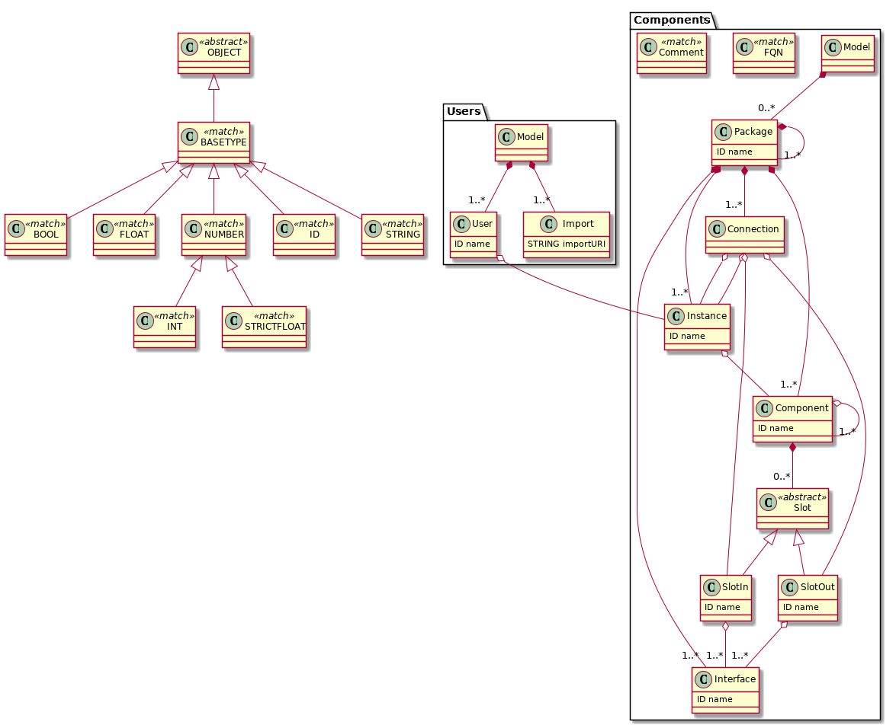
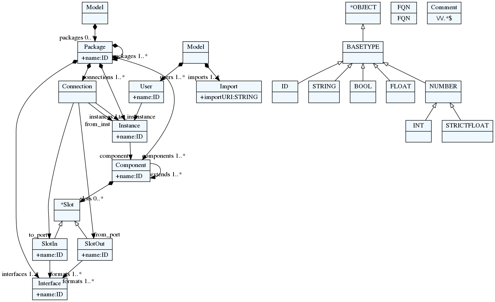

## Components.tx
 * source: ../../tests/functional/test_scoping/metamodel_provider_utf-16-le/Components.tx
 * basename: tests_functional_test_scoping_metamodel_provider_utf-16-le_Components

		Model:
		        packages*=Package
		;
		
		Package:
		        'package' name=ID '{'
		        (
		        components+=Component
		        |
		        instances+=Instance
		        |
		        connections+=Connection
		        |
		        packages+=Package
		        |
		        interfaces+=Interface
		        )*
		        '}'
		;
		
		Interface: 'interface' name=ID;
		
		// A component defines something with in/out ports
		// A component can inherit form another component --> lookup with inheritance
		Component:
		    'component' name=ID ('extends' extends+=[Component|FQN][','])? '{'
		        slots*=Slot
		    '}'
		;
		
		Slot: SlotIn|SlotOut;
		
		SlotIn:
		    'in' name=ID
		    ('(''''format' formats+=[Interface|FQN][','] ')')?
		;
		SlotOut:
		    'out' name=ID
		    ('(' '''format' formats+=[Interface|FQN][','] ')')?
		;
		
		// An instance of a component can be connected to other instances
		// always with portout --> portin
		Instance:
		    'instance' name=ID ':' component=[Component|FQN] ;
		
		// A connection connects two instances
		// --> lookup of ports to corresponding component belonging to the instance
		// --> lookup of ports with inheritance
		Connection:
		    'connect'
		      from_inst=[Instance|ID] '.' from_port=[SlotOut|ID]
		    'to'
		      to_inst=[Instance|ID] '.' to_port=[SlotIn|ID]
		;
		
		FQN: ID+['.'];
		Comment: /\/\/.*$/;

## Base.tx
 * source: ../../tests/functional/test_scoping/metamodel_provider3/Base.tx
 * basename: tests_functional_test_scoping_metamodel_provider3_Base

		Cls: "class" name=ID (
		    ( "extends" extends+=[Cls][','])?
		    "{"
		        methods+=Method*
		    "}"
		    )?;
		
		Method: "method" name=ID;
		Obj: "obj" name=ID ":" ref=[Cls];
		Call: "call" name=ID ":" obj=[Obj] "." method=[Method];
		
		Import: 'import' importURI=STRING;
		Comment: /\/\/.*/;

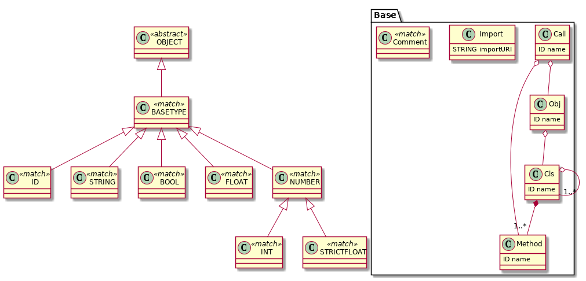
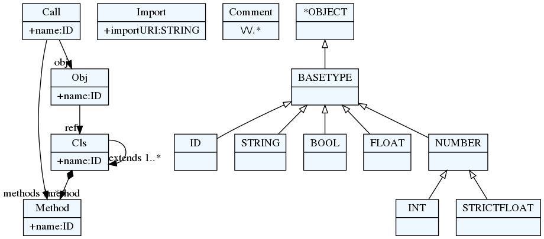

## B.tx
 * source: ../../tests/functional/test_scoping/metamodel_provider3/B.tx
 * basename: tests_functional_test_scoping_metamodel_provider3_B

		import Base
		
		Model:
		    "B"  ":"
		    imports+=Import*
		    cls+=Cls*
		    obj+=Obj*
		    call+=Call*
		;

## C.tx
 * source: ../../tests/functional/test_scoping/metamodel_provider3/C.tx
 * basename: tests_functional_test_scoping_metamodel_provider3_C

		import Base
		
		Model:
		    "C"  ":"
		    imports+=Import*
		    cls+=Cls*
		    obj+=Obj*
		    call+=Call*
		;

## A.tx
 * source: ../../tests/functional/test_scoping/metamodel_provider3/A.tx
 * basename: tests_functional_test_scoping_metamodel_provider3_A

		import Base
		
		Model:
		    "A"  ":"
		    imports+=Import*
		    cls+=Cls*
		    obj+=Obj*
		    call+=Call*
		;
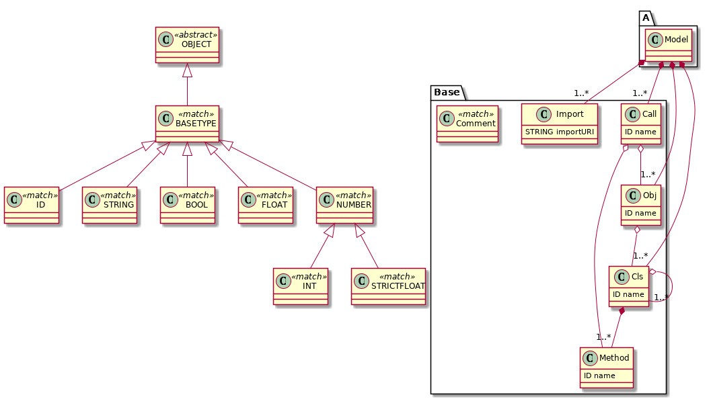
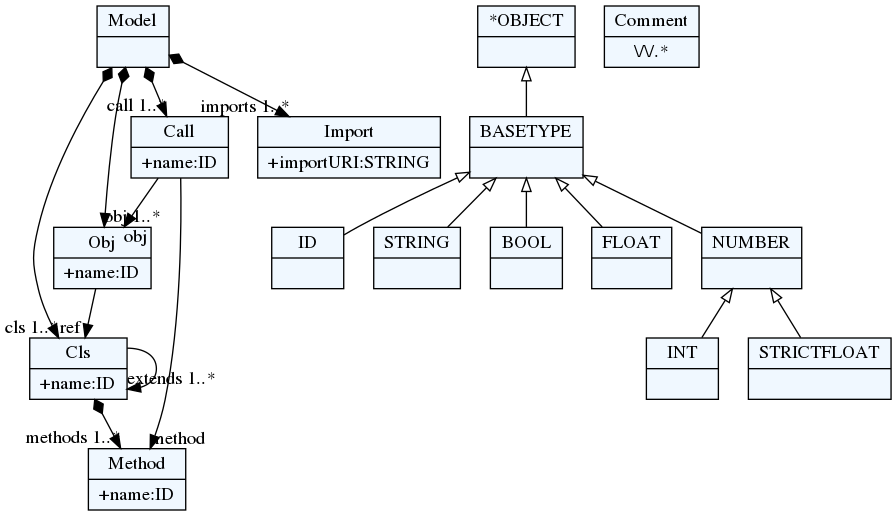

## first_diamond.tx
 * source: ../../tests/functional/test_metamodel/import/first_diamond.tx
 * basename: tests_functional_test_metamodel_import_first_diamond

		import diamond.second
		import diamond.third
		
		First:
		  'second' seconds+=Second
		  'third' thirds+=Third
		;
		

## third_repr.tx
 * source: ../../tests/functional/test_metamodel/import/repr/third_repr.tx
 * basename: tests_functional_test_metamodel_import_repr_third_repr

		Third:
		    a=INT
		;

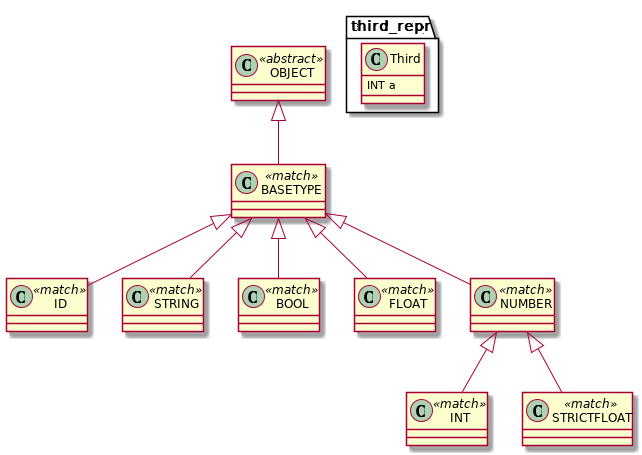

## second_repr.tx
 * source: ../../tests/functional/test_metamodel/import/repr/second_repr.tx
 * basename: tests_functional_test_metamodel_import_repr_second_repr

		import third_repr
		
		Second:
		   thirds+=Third
		;

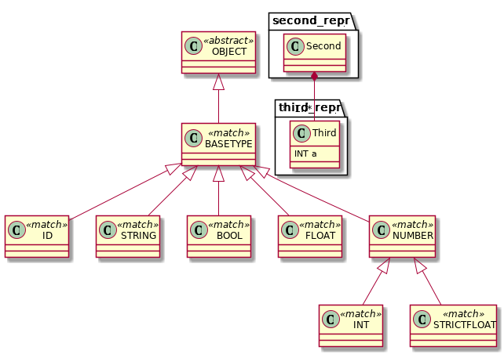

## first_repr.tx
 * source: ../../tests/functional/test_metamodel/import/repr/first_repr.tx
 * basename: tests_functional_test_metamodel_import_repr_first_repr

		import second_repr
		
		First:
		    'second' seconds+=Second
		;

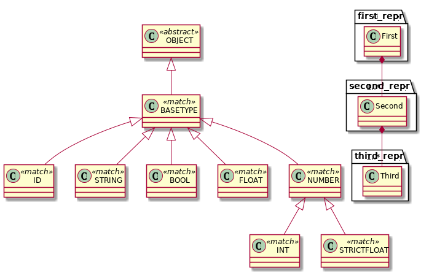
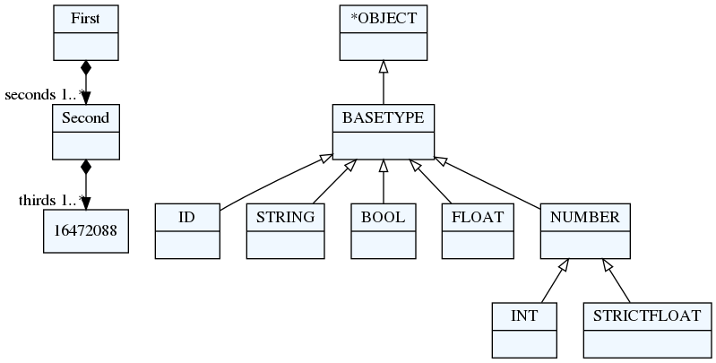

## third.tx
 * source: ../../tests/functional/test_metamodel/import/diamond/third.tx
 * basename: tests_functional_test_metamodel_import_diamond_third

		import last
		
		Third:
		    diamond=MyDiamondRule
		;

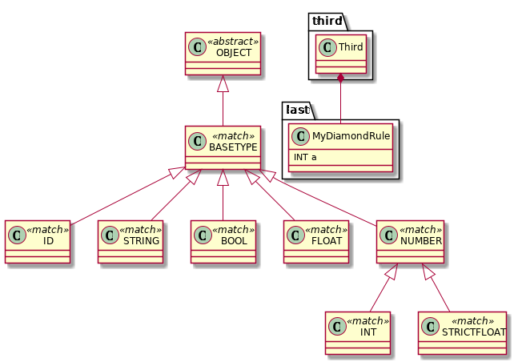

## last.tx
 * source: ../../tests/functional/test_metamodel/import/diamond/last.tx
 * basename: tests_functional_test_metamodel_import_diamond_las

		MyDiamondRule:
		    a=INT
		;

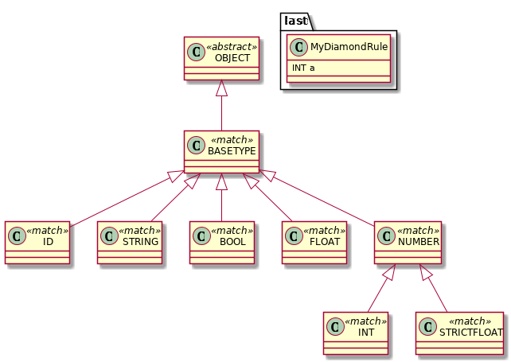
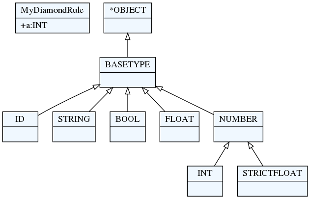

## second.tx
 * source: ../../tests/functional/test_metamodel/import/diamond/second.tx
 * basename: tests_functional_test_metamodel_import_diamond_second

		import last
		
		Second:
		    diamond=MyDiamondRule
		;

## first_diamond.tx
 * source: ../../tests/functional/test_import/importoverride/first_diamond.tx
 * basename: tests_functional_test_import_importoverride_first_diamond

		import diamond.second
		import diamond.third
		
		First:
		  'second' seconds+=Second
		  'third' thirds+=Third
		;
		

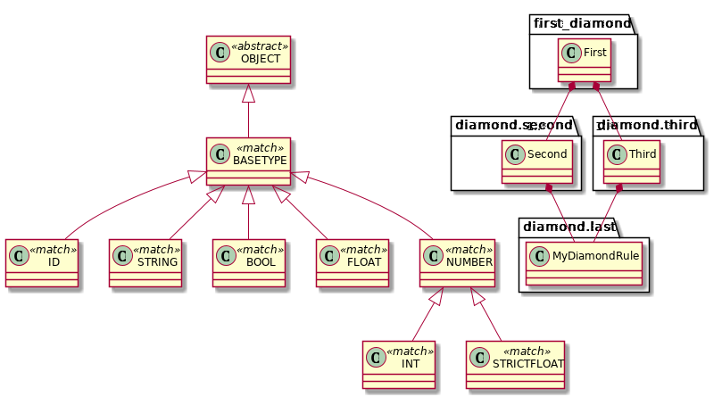
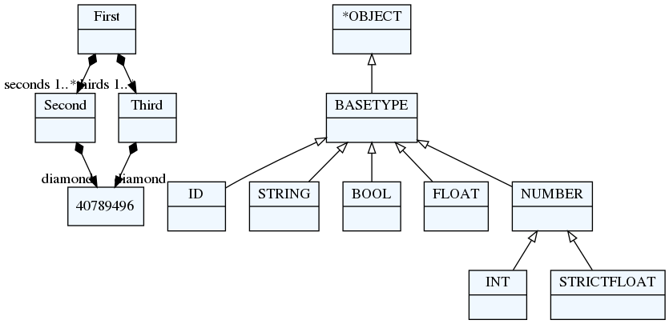

## first_new.tx
 * source: ../../tests/functional/test_import/importoverride/first_new.tx
 * basename: tests_functional_test_import_importoverride_first_new

		import second
		
		First:
		  'first' first+=Second
		  'third' third+=Third
		;
		
		Third:
		  chain=STRING
		;

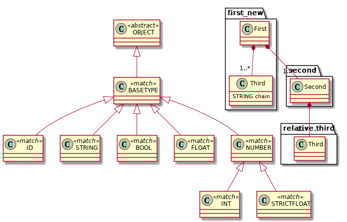
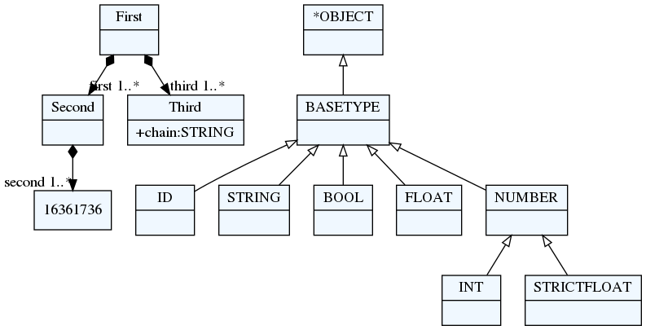

## first.tx
 * source: ../../tests/functional/test_import/importoverride/first.tx
 * basename: tests_functional_test_import_importoverride_firs

		import second
		import relative.third
		
		First:
		  'first' first+=Second
		  'third' third+=Third
		;
		
		Third:
		  chain=STRING
		;

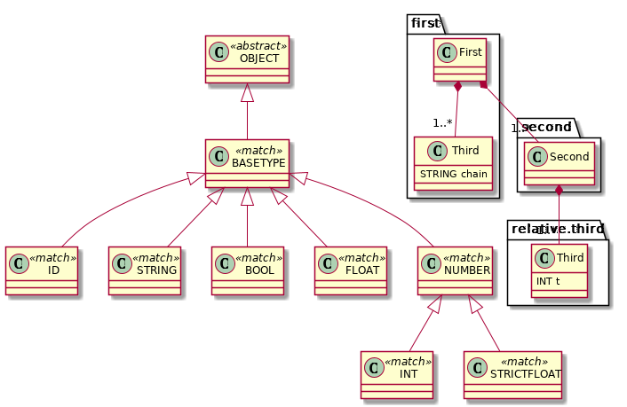
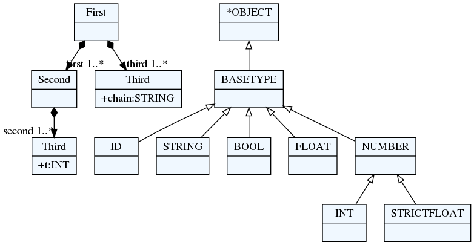

## second.tx
 * source: ../../tests/functional/test_import/importoverride/second.tx
 * basename: tests_functional_test_import_importoverride_second

		import relative.third
		
		Second:
		  second+=Third
		;

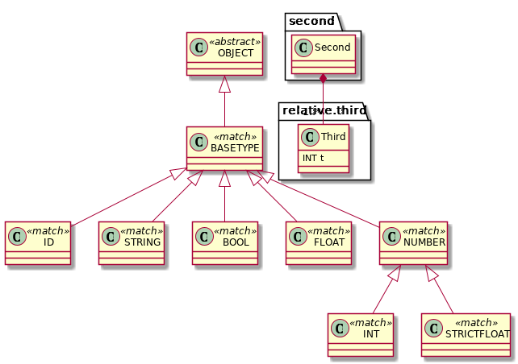
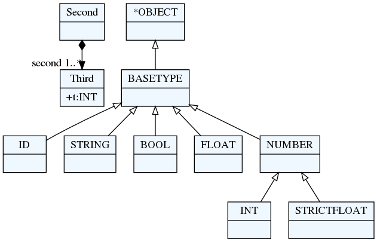

## third.tx
 * source: ../../tests/functional/test_import/importoverride/relative/third.tx
 * basename: tests_functional_test_import_importoverride_relative_third

		
		Third:
		  t=INT
		;

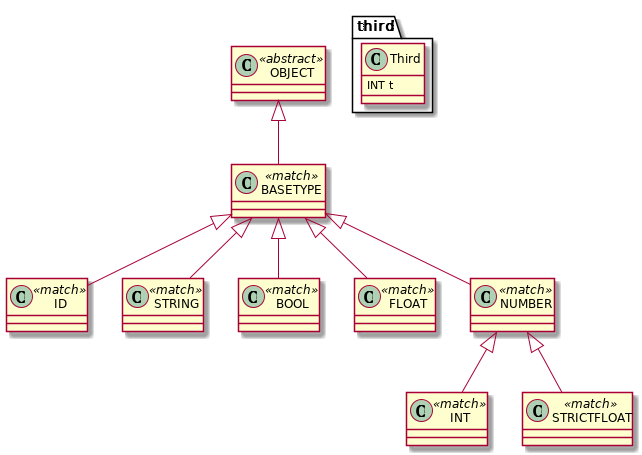

## third.tx
 * source: ../../tests/functional/test_import/importoverride/diamond/third.tx
 * basename: tests_functional_test_import_importoverride_diamond_third

		import last
		
		Third:
		    diamond=MyDiamondRule
		;

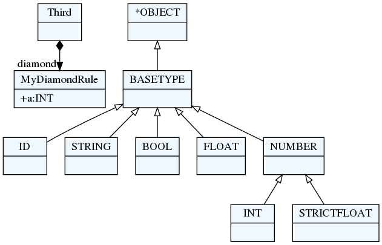

## last.tx
 * source: ../../tests/functional/test_import/importoverride/diamond/last.tx
 * basename: tests_functional_test_import_importoverride_diamond_las

		MyDiamondRule:
		    a=INT
		;

## second.tx
 * source: ../../tests/functional/test_import/importoverride/diamond/second.tx
 * basename: tests_functional_test_import_importoverride_diamond_second

		import last
		
		Second:
		    diamond=MyDiamondRule
		;

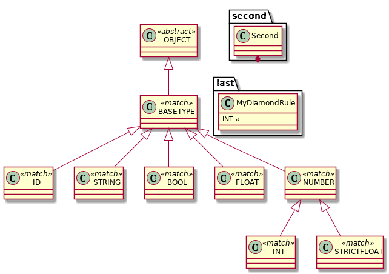

## first.tx
 * source: ../../tests/functional/test_import/multiple/first.tx
 * basename: tests_functional_test_import_multiple_firs

		import second
		import relative.third
		
		First:
		  'first' seconds+=Second
		  'third' thirds+=Third
		;
		
		Third:
		  t=STRING
		;

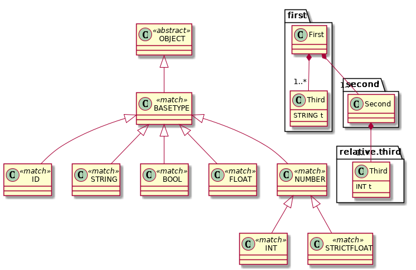
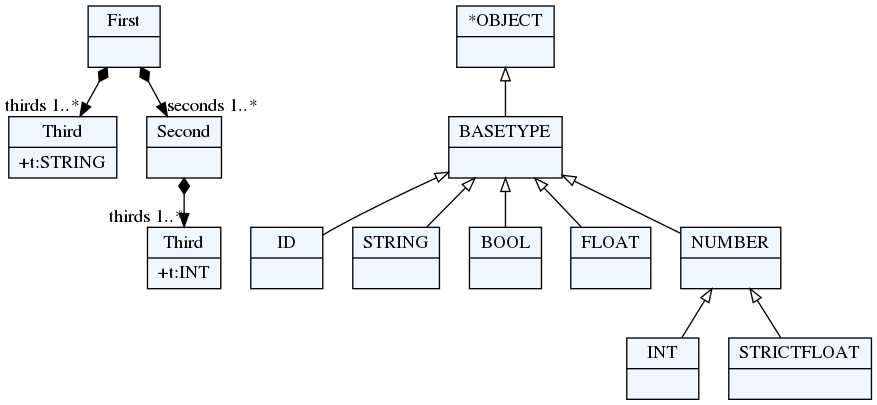

## second.tx
 * source: ../../tests/functional/test_import/multiple/second.tx
 * basename: tests_functional_test_import_multiple_second

		import relative.third
		
		Second:
		  thirds+=Third
		;

## third.tx
 * source: ../../tests/functional/test_import/multiple/relative/third.tx
 * basename: tests_functional_test_import_multiple_relative_third

		
		Third:
		  t=INT
		;

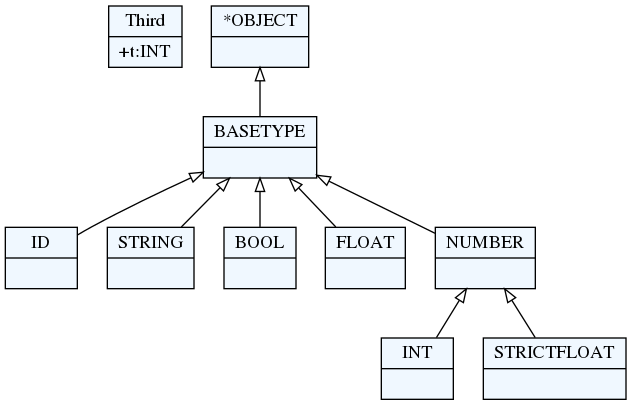

## first.tx
 * source: ../../tests/functional/test_import/relativeimport/first.tx
 * basename: tests_functional_test_import_relativeimport_firs

		import second
		import relative.third
		
		First:
		  'first'
		    'second' second+=Second     // Second is defined in imported grammar
		    'third' third+=Third      // For testing relative importing
		  'endfirst'
		;

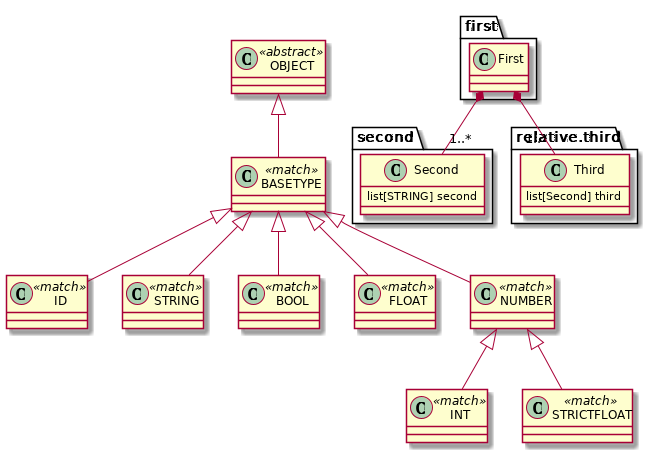
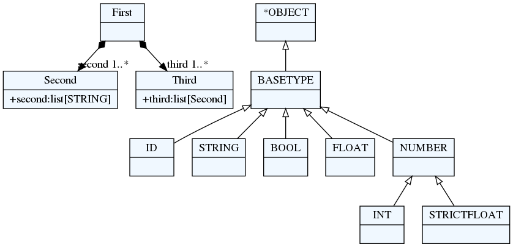

## second.tx
 * source: ../../tests/functional/test_import/relativeimport/second.tx
 * basename: tests_functional_test_import_relativeimport_second

		
		Second:
		  second+=STRING
		;

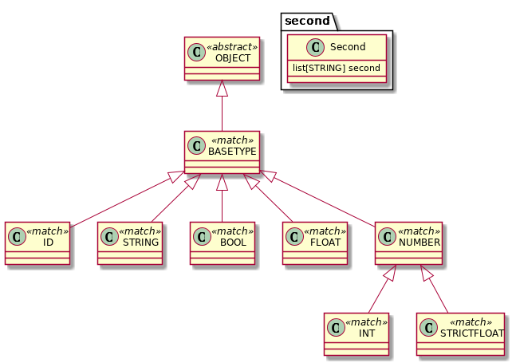
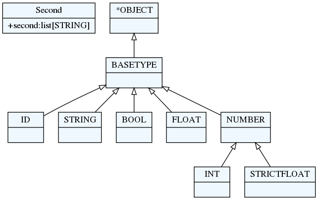

## third.tx
 * source: ../../tests/functional/test_import/relativeimport/relative/third.tx
 * basename: tests_functional_test_import_relativeimport_relative_third

		import fourth
		
		Third:
		  third+=Second       // Second rule should be that one defined in fourth.tx
		;
		

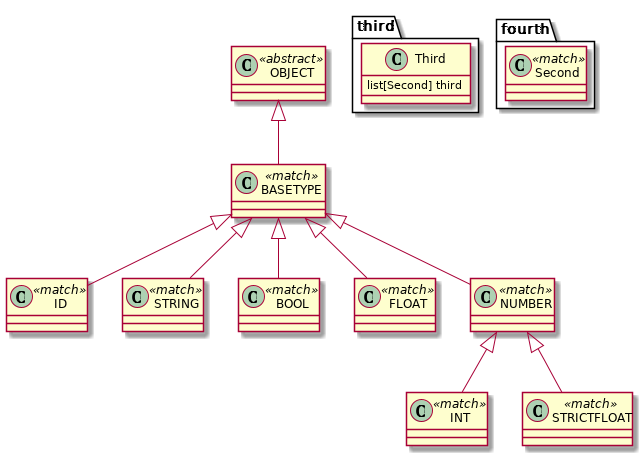
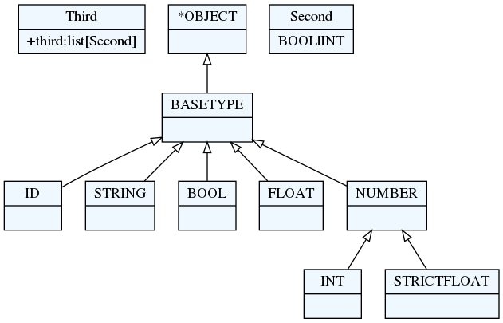

## fourth.tx
 * source: ../../tests/functional/test_import/relativeimport/relative/fourth.tx
 * basename: tests_functional_test_import_relativeimport_relative_fourth

		Second:
		  BOOL|INT
		;
		

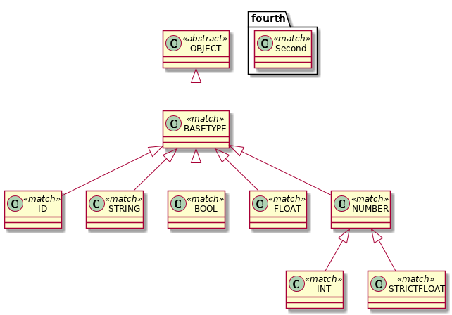
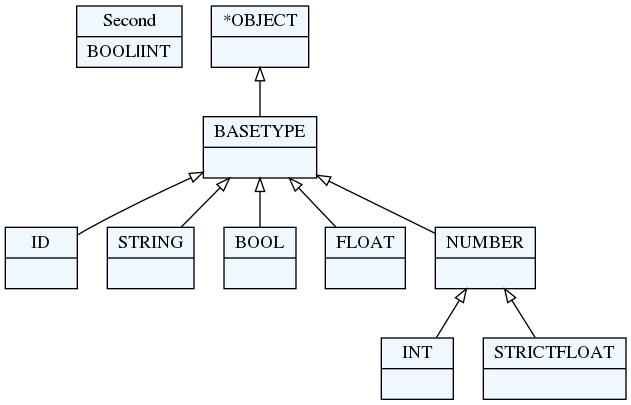

## B.tx
 * source: ../../tests/functional/regressions/issue140/B.tx
 * basename: tests_functional_regressions_issue140_B

		import A
		Model: x+=X;
		X: 'X' name=ID '{' r+=R '}';
		R: R1|C1;
		R1: 'R1' ref=[E];

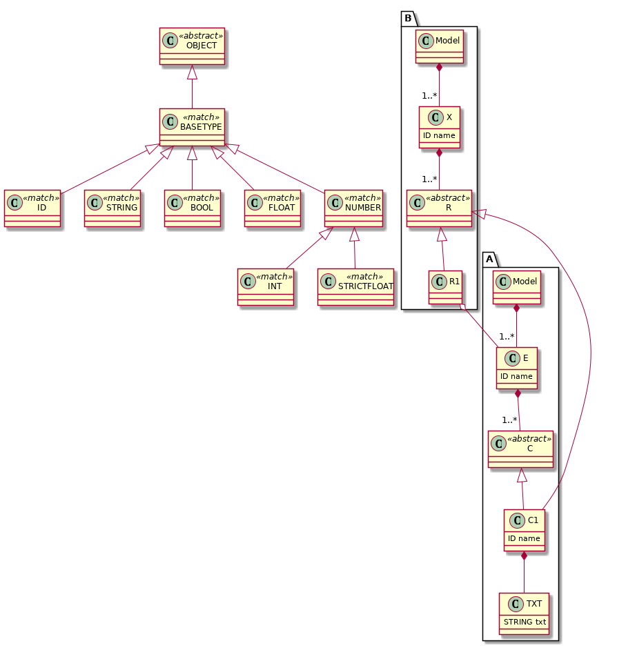
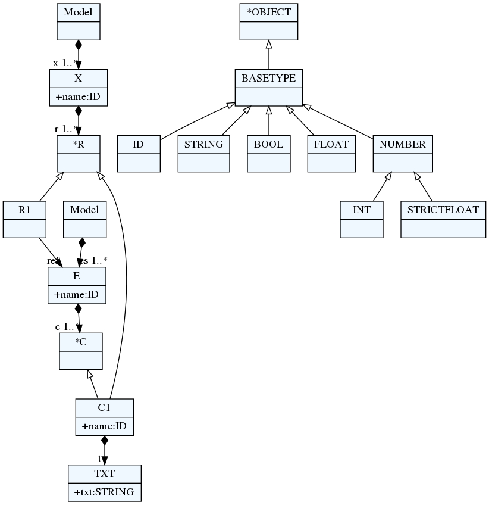

## A.tx
 * source: ../../tests/functional/regressions/issue140/A.tx
 * basename: tests_functional_regressions_issue140_A

		Model: es+=E;
		E: 'E' name=ID '{' c+=C '}';
		C: C1;
		C1: 'C1' name=ID t=TXT;
		
		TXT: txt=STRING;

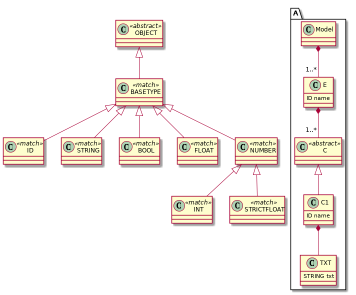
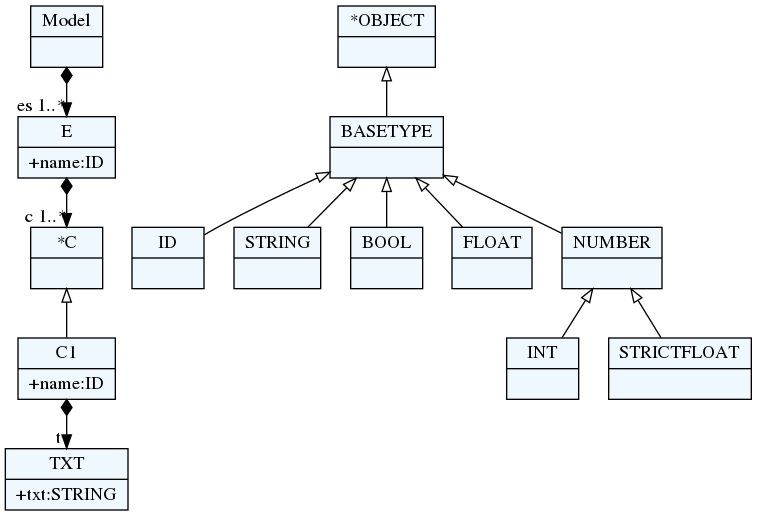

## pyflies.tx
 * source: ../../examples/pyFlies/pyflies.tx
 * basename: examples_pyFlies_pyflies

		/*
		  This is a textX specification of pyFlies DSL for Reaction Time test
		  experiments definition.
		  Author: Igor R. Dejanovic <igor DOT dejanovic AT gmail DOT com>
		  Copyright: (c) 2014 Igor R. Dejanovic <igor DOT dejanovic AT gmail DOT com>
		  License: MIT License
		*/
		
		PyFliesModel:
		  "experiment" name=STRING
		  (description=STRING)?
		  ("basepath" basepath=STRING)?
		  blocks+=BlockType
		  structure=Structure
		  targets*=Target
		;
		
		BlockType:
		  TestType|ScreenType|SubjectType
		;
		
		TestType:
		  "test" name=ID "{"
		    conditions = Conditions
		    stimuli = Stimuli
		  "}"
		;
		
		Conditions:
		  'conditions' '{'
		    // Strip all whitespaces before next WORD
		    // becouse next rule is eolterm and
		    // terminates on newlines.
		    /\s*/
		
		    // Parameter names are in the first line of condition specification
		    varNames+=WORD[eolterm]    // match var names until end of line
		
		    // The rest of the description are conditions, one per line
		    // The order of condition values match the param name positions.
		    conditions+=Condition
		  '}'
		;
		
		Condition:
		  /\s*/
		  varValues+=WORD[eolterm]  // match values until end of line
		;
		
		Stimuli:
		  'stimuli' '{'
		      condStimuli+=ConditionStimuli
		      ('duration' dmin=INT (dmax=INT)?)?
		  '}'
		;
		
		ConditionStimuli:
		  // Condition stimuli is given in the form of
		  // condition match expression : stimuli definitions
		  conditionMatch=ConditionMatch ':' stimuli+=Stimulus
		;
		
		ConditionMatch:
		  expression=ConditionMatchExpression
		;
		
		ConditionMatchExpression:
		   FixedCondition|OrdinalCondition|ExpressionCondition
		;
		
		FixedCondition:
		  expression = FixedConditionEnum
		;
		
		FixedConditionEnum:
		  "all"|"error"|"fixation"|"correct"
		;
		
		OrdinalCondition:
		  expression = INT
		;
		
		ExpressionCondition:
		  expression = OrExpression
		;
		
		OrExpression: operand=AndExpression ('or' operand=AndExpression)*;
		AndExpression: operand=NotEqualsExpression ('and' operand=NotEqualsExpression)*;
		
		NotEqualsExpression:
		  NotExpression | EqualsExpression;
		
		NotExpression: 'not' operand=EqualsExpression;
		EqualsExpression: varName=WORD '=' varValue=WORD;
		
		
		Stimulus:
		  Image|Shape|Sound|Audio|Text
		;
		
		Image:
		  'image' '(' file=STRING
		   (','
		        ( ('position' x=WORD (y=INT)?)
		          |('duration' dmin=WORD (dmax=INT)?)
		          |('keep')
		          |('size' width=WORD (height=INT)?)
		        )*[','])?
		  ')'
		;
		
		Shape:
		  'shape' '(' shape=ShapeType
		   (','
		        ( ('position' x=WORD (y=INT)?)
		          |('duration' dmin=WORD (dmax=INT)?)
		          |('keep')
		          |('size' width=WORD (height=INT)?)
		          |('color' color=WORD)
		          |('fillcolor' fillcolor=WORD)
		          |('linewidth' lineWidth=WORD)
		        )*[','])?
		  ')'
		;
		
		ShapeType:
		  "rectangle"|"circle"|"triangle"|"cross"
		;
		
		Text:
		  'text' '(' text=TextType
		   (','
		        ( ('position' x=WORD (y=INT)?)
		          |('duration' dmin=WORD (dmax=INT)?)
		          |('keep')
		          |('size' width=WORD (height=INT)?)
		          |('color' color=WORD)
		        )*[','])?
		  ')'
		;
		
		TextType:
		  STRING|/\w*\b/
		;
		
		WORD:
		  /[-\w]*\b/
		;
		
		Sound:
		  'sound' '(' frequency=INT
		   (',' ('duration' dmin=WORD (dmax=INT)?))?
		  ')'
		;
		
		Audio:
		  'audio' '(' file=STRING
		   (',' ('duration' dmin=WORD (dmax=INT)?))?
		  ')'
		;
		
		
		Block:
		  Sequence|Randomize
		;
		
		TestInstance:
		  'test' type=[TestType] trials=INT (practice?="practice"|randomize?="randomize")#
		;
		
		ScreenInstance:
		  'screen' type=[ScreenType]
		;
		
		SubjectInstance:
		  'subject' type=[SubjectType]
		;
		
		Reference:
		  TestInstance|ScreenInstance|SubjectInstance
		;
		
		StructureElement:
		  Reference|Block
		;
		
		
		Structure:
		  'structure' '{'
		    elements*=StructureElement
		  '}'
		;
		
		Sequence:
		  'sequence' '{'
		    elements*=StructureElement
		  '}'
		;
		
		Randomize:
		  'randomize' '{'
		    elements*=StructureElement
		  '}'
		;
		
		ScreenType:
		  'screen' name=ID "{"
		  /*    content=/(.|\n)*?(?=})/  */
		      content=/[^}]*/
		  '}'
		;
		
		SubjectType:
		  'subject' name=ID '{'
		    attribute+=SubjectAttribute
		  '}'
		;
		
		SubjectAttribute:
		  type=SubjectAttributeType name=ID (label=STRING)?
		;
		
		SubjectAttributeType:
		  "int"|"string"|"float"|Enum
		;
		
		Enum:
		  '[' values+=ID[','] ']'
		;
		
		Target:
		  'target' name=ID '{'
		    'output' '=' output=STRING
		    'responses' '{'
		        responseMap*=ResponseMap
		    '}'
		    targetParam*=TargetParam
		  '}'
		;
		
		TargetParam:
		  name=ID '=' value=BASETYPE
		;
		
		ResponseMap:
		  name=ID '=' target=BASETYPE
		;
		
		// Special rule for comments
		Comment:
		  /\/\/.*$/|/\/\*(.|\n)*?\*\//  // Non-greedy match of block component content
		;
		

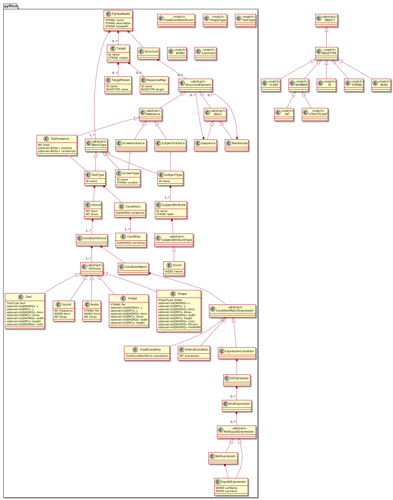
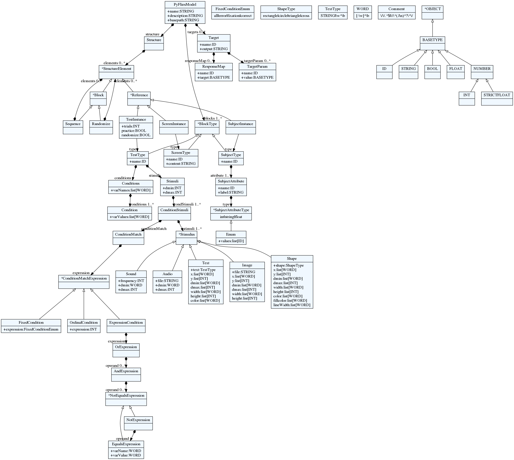

## rhapsody.tx
 * source: ../../examples/IBM_Rhapsody/rhapsody.tx
 * basename: examples_IBM_Rhapsody_rhapsody

		RhapsodyModel:
		    header= /[^\n]*/
		    root=Object
		;
		
		Object:
		    '{' name=ID
		        properties+=Property
		    '}'
		;
		
		Property:
		    '-' name=ID '=' (values=Value (';'? !('-'|'}') values=Value)*)? ';'?
		;
		
		Value:
		     STRING | NUMBER | GUID | Object | ID
		;
		
		GUID:
		    'GUID' value=/[a-f0-9]*-[a-f0-9]*-[a-f0-9]*-[a-f0-9]*-[a-f0-9]*/
		;
		
		

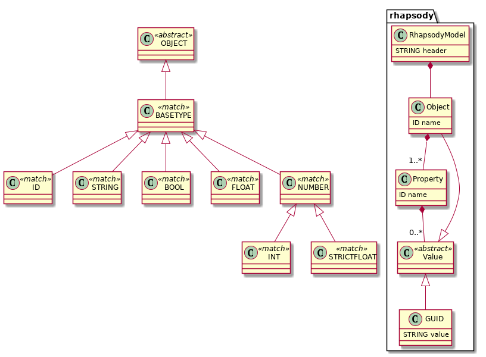
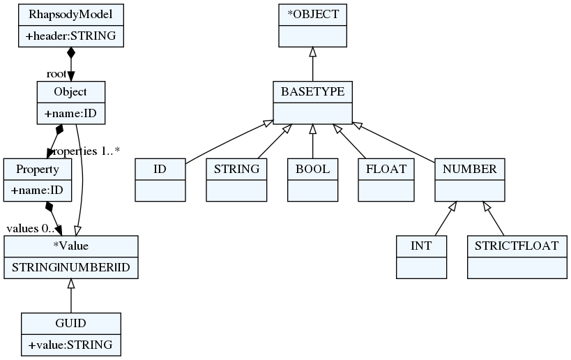

## entity.tx
 * source: ../../examples/Entity/entity.tx
 * basename: examples_Entity_entity

		/*
		  Entity DSL grammar.
		*/
		
		EntityModel:
		    types*=SimpleType       // At the beginning of model we can define
		                            // zero or more simple types.
		    entities+=Entity        // Each model has one or more entities.
		;
		
		Entity:
		    'entity' name=ID '{'
		        properties+=Property // Each entity has one or more properties.
		    '}'
		;
		
		Property:
		    name=ID ':' type=[Type]     // type is a reference to Type instance.
		                                // There are two built-in simple types 
		                                // registered on meta-model in entity_test.py
		;
		
		// Type can be SimpleType or Entity
		Type:
		    SimpleType | Entity
		;
		
		SimpleType:
		    'type' name=ID
		;
		
		// Special rule for comments. Comments start with //
		Comment:
		    /\/\/.*$/
		;

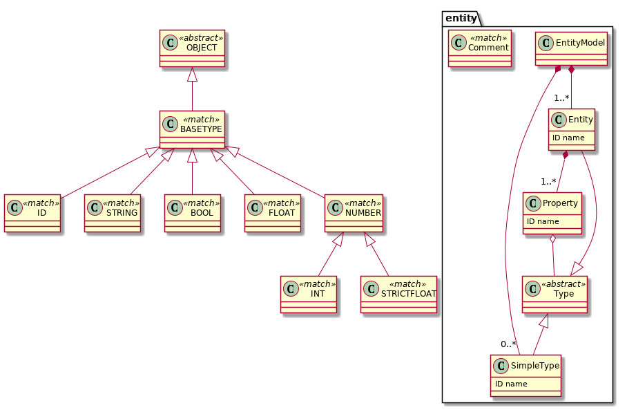
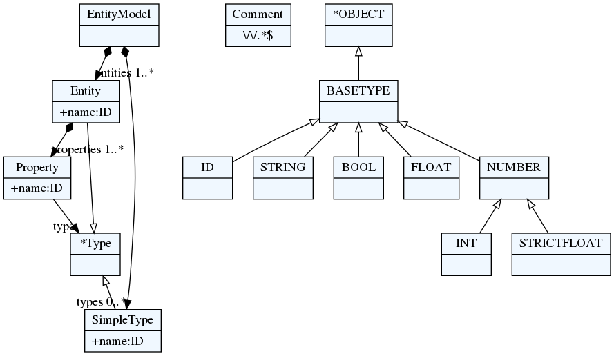

## robot.tx
 * source: ../../examples/robot/robot.tx
 * basename: examples_robot_robo

		/*
		This example is inspired by an example from LISA tool (http://labraj.uni-mb.si/lisa/)
		presented during the lecture given by prof. Marjan Mernik (http://lpm.uni-mb.si/mernik/)
		at the University of Novi Sad in June, 2011.
		
		An example of the robot program:
		   begin
		       initial 3, 1
		       up 4
		       left 9
		       down
		       right 1
		   end
		
		*/
		
		// This is a common rule. For each rule a class with the same name will be
		// created.
		Program:
		  'begin'
		    commands*=Command    // *= operator means zero or more matches.
		                         // commands will be
		                         // a list of Command objects
		  'end'
		;
		
		// This is an example of abstract rule. Command class will never be instantiated
		// in the model.
		Command:
		  InitialCommand | MoveCommand
		;
		
		InitialCommand:
		  'initial' x=INT ',' y=INT
		;
		
		MoveCommand:
		  direction=Direction (steps=INT)?
		;
		
		// This is an example of a Match Rule
		// Match rules has either string match, regex match or other match rule as
		// its alternatives (e.g. INT, STRING... or some user match rule)
		// Match rule is treated as a contained match. No class will get created.
		Direction:
		  "up"|"down"|"left"|"right"
		;
		
		
		// Special rule for comments. In robot programs comments start with //
		Comment:
		  /\/\/.*$/
		;

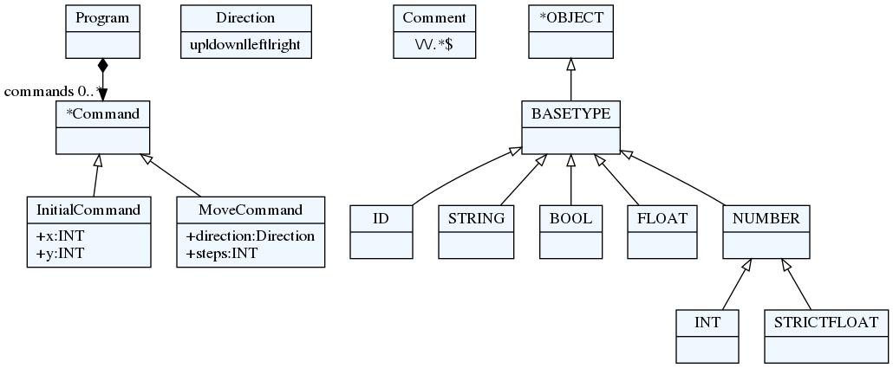

## hello.tx
 * source: ../../examples/hello_world/hello.tx
 * basename: examples_hello_world_hello

		HelloWorldModel:
		  'hello'  to_greet+=Who[',']
		;
		
		Who:
		  name = /[^,]*/
		;
		

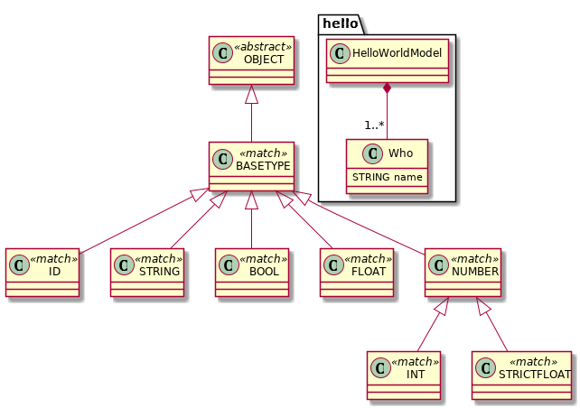
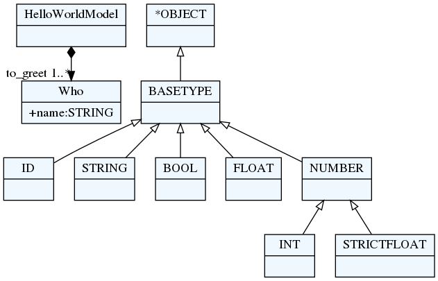

## workflow.tx
 * source: ../../examples/workflow/workflow.tx
 * basename: examples_workflow_workflow

		/* Simple workflow language. */
		
		Workflow:
		
		  'workflow' name=ID (desc=STRING)?
		  'init' init=[Task]
		
		  tasks *= Task
		
		  actions *= Action
		
		;
		
		Task:
		  'task' name=ID '{'
		    (('entry' entry=[Action])|
		    ('leave' leave=[Action])|
		    ('next' next+=[Task][',']))*
		  '}'
		;
		
		Action:
		  'action' name=ID
		;
		
		Comment:
		  /\/\/.*$/
		;
		

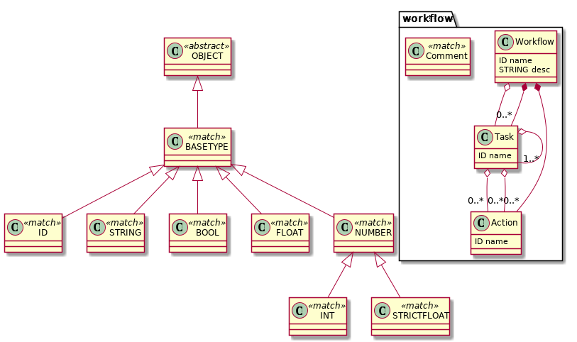
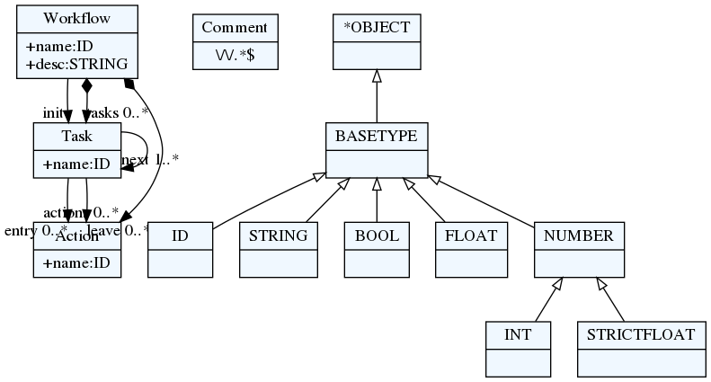

## state_machine.tx
 * source: ../../examples/StateMachine/state_machine.tx
 * basename: examples_StateMachine_state_machine

		StateMachine:
		    'events'
		        events+=Event
		    'end'
		
		    ('resetEvents'
		        resetEvents+=[Event|SMID]
		    'end')?
		
		    'commands'
		        commands+=Command
		    'end'
		
		    states+=State
		;
		
		Keyword:
		    'end' | 'events' | 'resetEvents' | 'state' | 'actions'
		;
		
		Event:
		    name=SMID code=ID
		;
		
		Command:
		    name=SMID code=ID
		;
		
		State:
		    'state' name=ID
		        ('actions' '{' actions+=[Command] '}')?
		        transitions+=Transition
		    'end'
		;
		
		Transition:
		    event=[Event|SMID] '=>' to_state=[State]
		;
		
		SMID:
		    !Keyword ID
		;
		
		Comment:
		    /\/\*(.|\n)*?\*\//
		;

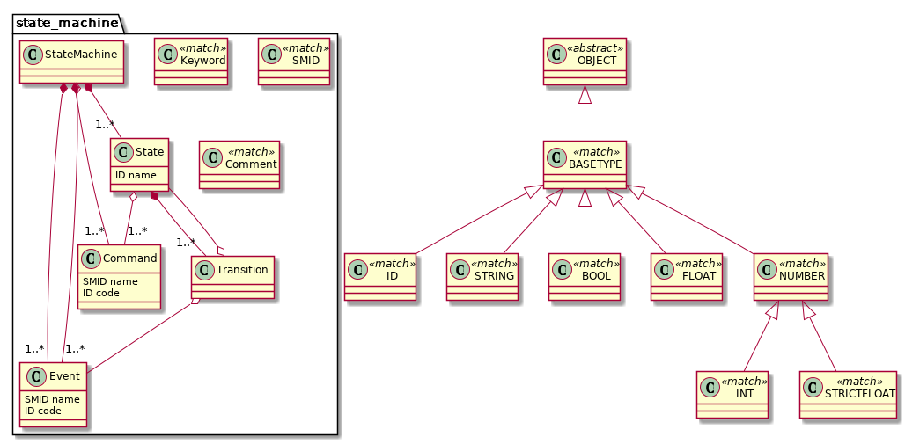
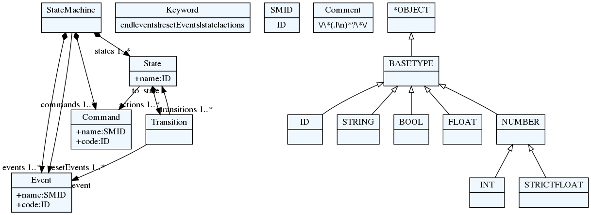

## json.tx
 * source: ../../examples/json/json.tx
 * basename: examples_json_json

		/*
		    A grammar for JSON data-interchange format.
		    See: http://www.json.org/
		*/
		File:
		    Array | Object
		;
		
		Array:
		    "[" values*=Value[','] "]"
		;
		
		Value:
		    STRING | FLOAT | BOOL | Object | Array | "null"
		;
		
		Object:
		    "{" members*=Member[','] "}"
		;
		
		Member:
		    key=STRING ':' value=Value
		;

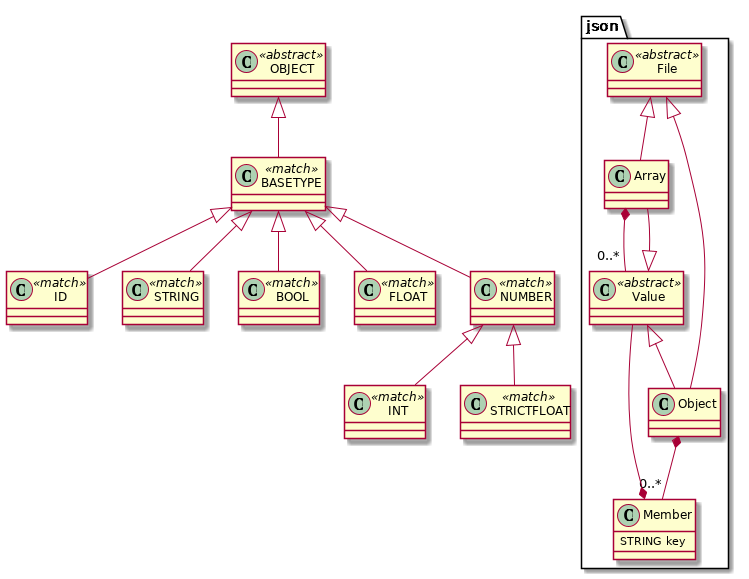
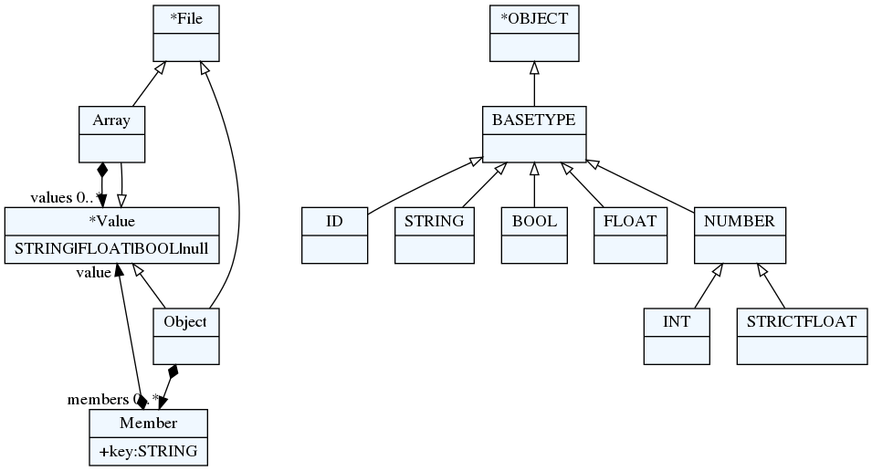

## entity.tx
 * source: ../../docs/tutorials/entity/entity.tx
 * basename: docs_tutorials_entity_entity

		EntityModel:
		    simple_type*=SimpleType
		    entities+=Entity
		;
		
		Entity:
		    'entity' name=ID '{'
		        properties+=Property
		    '}'
		;
		
		Property:
		    name=ID ':' type=[Type]
		;
		
		Type:
		    SimpleType | Entity
		;
		
		SimpleType:
		    'type' name=ID
		;

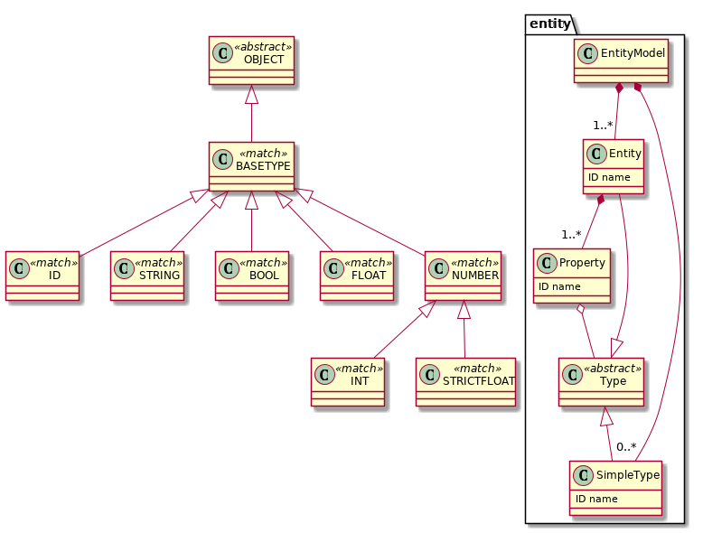
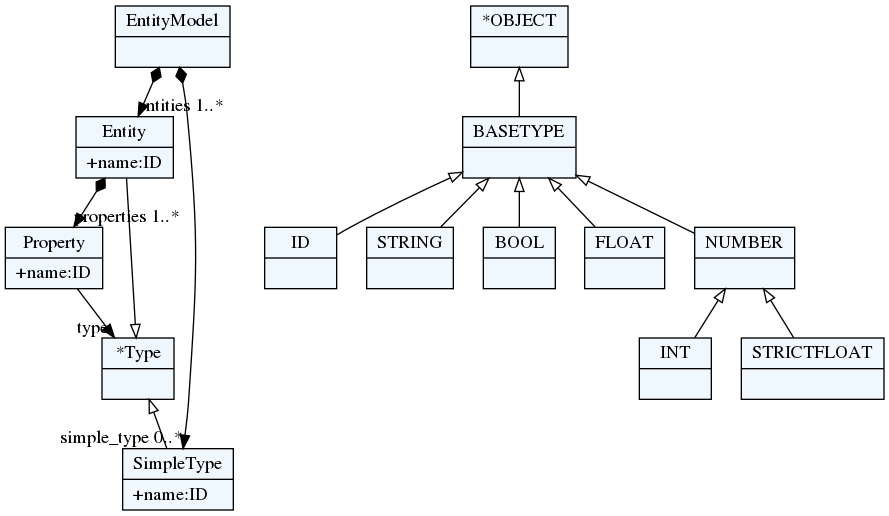

## entity1.tx
 * source: ../../docs/tutorials/entity/entity1.tx
 * basename: docs_tutorials_entity_entity1

		EntityModel:
		    entities+=Entity
		;
		
		Entity:
		    'entity' name=ID '{'
		        properties+=Property
		    '}'
		;
		
		Property:
		    name=ID ':' type=ID
		;
		

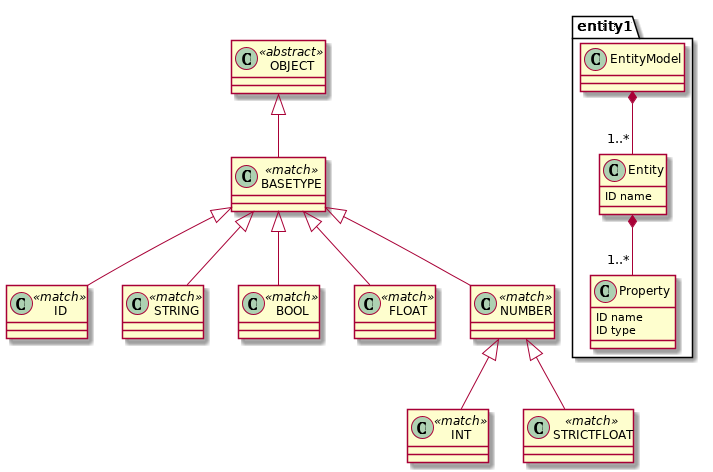

